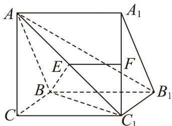

<!-- question-source:start -->
【变式2】如图，在三棱柱 $ABC-A_{1}B_{1}C_{1}$ 中，E，F分别为线段 $AC_{1}$ ， $A_{1}C_{1}$ 上的点， $AE=\lambda\overline{AC_{1}}$ ， $A_{1}F=\lambda\overline{A_{1}C_{1}}$ ， $\lambda\in(0,1)$

(1)求证： $EF \parallel$ 平面 $BCC_{1}B_{1}$

(2)在线段 $BC_{1}$ 上是否存在一点 $G$ ，使平面 $EFG / /$ 平面 $ABB_{1}A_{1}$ ？请说明理由.
<!-- question-source:end -->

![[高中/课堂同步/题库/人教A版高中数学同步讲义(2026)/02_必修第二册/第八章 立体几何初步/专题8.5 空间直线、平面的平行（高效培优讲义）/题型08_补全平面与平面平行的条件/questions/answers/Q00069847A1.md]]
