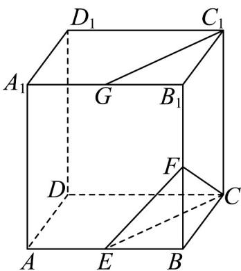
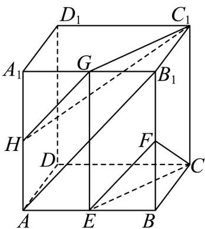

## 题型08 补全平面与平面平行的条件

【典例1】如图，在长方体 $ABCD - A_{1}B_{1}C_{1}D_{1}$ 中， $E, F, G$ 分别是棱 $AB, BB_{1}, A_{1}B_{1}$ 的中点.

(1)证明： $C_{1}G//$ 平面CEF.

(2)在棱 $AA_{1}$ 上是否存在点 $H$ ，使得平面 $C_1GH //$ 平面 $CEF$ ？若存在，求出 $A_{1}A$ 的值；若不存在，请说明理由·

$$
\frac {A _ {1} H}{A _ {1} A}
$$

【答案】(1)证明见解析

(2) 存在， $\frac{A_{1}H}{A_{1}A}=\frac{1}{2}.$

【分析】（1）连接 $EG$ ，根据题意，证得四边形 $CEGC_{1}$ 是平行四边形，得到 $CE // C_{1}G$ ，结合线面平行的判

定定理，即可证得 $C_{1}G \parallel$ 平面 CEF；

(2) 连接 $AB_{1}$ ，分别证得 $EF // AB_{1}$ 和 $GH // EF$ ，得到 $GH //$ 平面 CEF，由 (1) 知 $C_{1}G //$ 平面 CEF，证得平

面 $C_1GH //$ 平面 $CEF$ ，即可得到答案·

【详解】（1）证明：如图所示，连接 $EG$

因为 E, G 分别是棱 $AB, A_{1}B_{1}$ 的中点，所以 $EG //BB_{1}, EG = BB_{1}$

由长方体的性质，可知 $BB_{1} / / CC_{1}, BB_{1} = CC_{1}$ ，则 $EG / / CC_{1}$ 且 $EG = CC_{1}$ ，

所以四边形 $CEGC_{1}$ 是平行四边形，所以 $CE // C_{1}G$

又因为 $CE \subset$ 平面 $CEF$ ，且 $C_1G \notin$ 平面 $CEF$ ，所以 $C_1G //$ 平面 $CEF$ .

(2) 解：取棱 $AA_{1}$ 的中点 H，连接 $GH, C_{1}H$ ，平面 $C_{1}GH //$ 平面 CEF，此时 $\frac{A_{1}H}{A_{1}A} = \frac{1}{2}$ .

理由如下：

连接 $AB_{1}$ ，因为 $E, F$ 分别为棱 $AB, BB_{1}$ 的中点，所以 $EF // AB_{1}$

因为 G, H 分别为棱 $A_{1}B_{1}, A_{1}A$ 的中点，所以 $GH // AB_{1}$ ，所以 $GH // EF$ ，

因为 $EF \subset$ 平面 CEF 且 GH $\not\subset$ 平面 CEF ，所以 GH // 平面 CEF ，

由（1）可知 $C_1G //$ 平面 $CEF$ ，且 $C_1G \subset$ 平面 $C_1GH$ ， $GH \nmid$ 平面 $C_1GH$ ， $C_1G \cap GH = G$ ，所以平面 $C_1GH //$

平面 CEF，

故在棱 $AA_{1}$ 上存在点 H ，使得平面 $C_{1}GH //$ 平面 CEF ，此时 $\frac{A_{1}H}{A_{1}A} = \frac{1}{2}$

![[高中/课堂同步/题库/人教A版高中数学同步讲义(2026)/02_必修第二册/第八章 立体几何初步/专题8.5 空间直线、平面的平行（高效培优讲义）/题型08_补全平面与平面平行的条件/questions/Q00069846.md]]
![[高中/课堂同步/题库/人教A版高中数学同步讲义(2026)/02_必修第二册/第八章 立体几何初步/专题8.5 空间直线、平面的平行（高效培优讲义）/题型08_补全平面与平面平行的条件/questions/Q00069847.md]]
![[高中/课堂同步/题库/人教A版高中数学同步讲义(2026)/02_必修第二册/第八章 立体几何初步/专题8.5 空间直线、平面的平行（高效培优讲义）/题型08_补全平面与平面平行的条件/questions/Q00069848.md]]
