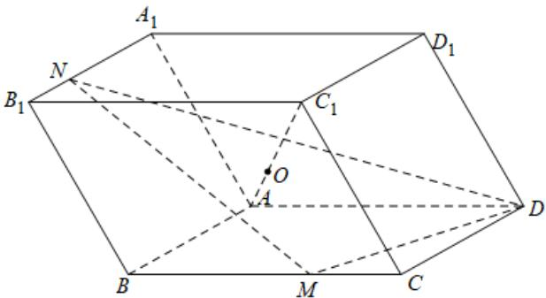

<!-- question-source:start -->
【变式1】在平行六面体 $ABCD - A_{1}B_{1}C_{1}D_{1}$ 中， $M$ ， $N$ 分别为棱 $BC$ ， $A_{1}B_{1}$ 上的点，且 $BM = 2MC$

$A_{1}N = 2NB_{1}$ ，直线 $AC_{1}$ 与平面DMN的交点 $O$ ，则 $\overline{OC_1}$ 的值为（）

$$
\frac {A O}{O C _ {1}}
$$

A. $\frac{3}{5}$ B. $\frac{4}{5}$ C. $\frac{8}{9}$ D. $\frac{9}{10}$
<!-- question-source:end -->

![[高中/课堂同步/题库/人教A版高中数学同步讲义(2026)/02_必修第二册/第八章 立体几何初步/专题8.5 空间直线、平面的平行（高效培优讲义）/题型09_空间平行的转化/questions/answers/Q00069849A1.md]]
