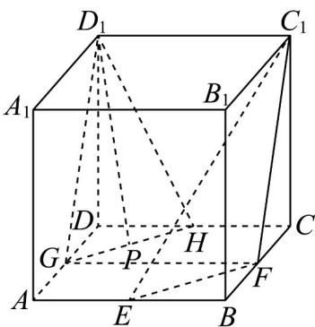

> [!faq]- 《专题8.5 空间直线、平面的平行（高效培优讲义）》官方解析
>
> > [!success]- **【答案】** $\left[\frac{3\sqrt{2}}{4},\frac{\sqrt{5}}{2}\right]$
>
> > [!note]- **【分析】**
> > 取 $AD$ 的中点 $G$ ，取 $CD$ 的中点为 $H$ ，连接 $D_{1}G, D_{1}H, GH, AC$ ，证明平面 $D_{1}GH //$ 平面 $C_{1}EF$ ，结合
> >
> > 直线 $D_{1}P$ 与平面 $C_{1}EF$ 无公共点，得到点 P 在线段 GH 上，由此求得 $D_{1}P$ 长的范围。
>
> > [!note]- **【解析】**
> > 如图所示，取 $AD$ 的中点 $G$ ，取 $CD$ 的中点为 $H$ ，连接 $D_{1}G, D_{1}H, GH, AC$
> >
> > 
> >
> > 由三角形的中位线的性质，可得 $EF // AC, GH // AC$ ，则 $GH // EF$
> >
> > 又由 $EF \subset$ 平面 $C_{1}EF$ ，GH $\not\subset$ 平面 $C_{1}EF$ ，可得 GH // 平面 $C_{1}EF$ ，
> >
> > 连接 $GF$ ，可得 $GF / / C_1D_1$ 且 $GF = C_1D_1$
> >
> > 则四边形 $GFC_{1}D_{1}$ 为平行四边形，可得 $GD_{1} / / C_{1}F$
> >
> > 因为 $C_{1}F \subset$ 平面 $C_{1}EF$ ， $D_{1}G \not\subset$ 平面 $C_{1}EF$ ，所以 $D_{1}G //$ 平面 $C_{1}EF$ ，
> >
> > 又因为 $D_{1}G \cap GH = G$ ， $D_{1}G, GH \subset$ 平面 $D_{1}GH$ ，所以平面 $D_{1}GH //$ 平面 $C_{1}EF$
> >
> > 由直线 $D_{1}P$ 与平面 $EFC_{1}$ 无公共点，所以点 $P$ 在线段 $GH$ 上，
> >
> > 当 $P$ 为 $GH$ 的中点时， $D_{1}P$ 取得最小值，最小值为 $\sqrt{DD_1^2 + DP^2} = \sqrt{1^2 + (\frac{\sqrt{2}}{4})^2} = \frac{3\sqrt{2}}{4}$
> >
> > 当 $P$ 与点 $G$ 或 $H$ 重合时， $D_{1}P$ 取得最大值，最大值为 $\sqrt{1^2 + (\frac{1}{2})^2} = \frac{\sqrt{5}}{2}$
> >
> > 所以线段 $D_{1}P$ 的长的范围是 $\left[\frac{3\sqrt{2}}{4},\frac{\sqrt{5}}{2}\right]$
> >
> > 故答案为： $\left[\frac{3\sqrt{2}}{4},\frac{\sqrt{5}}{2}\right]$
