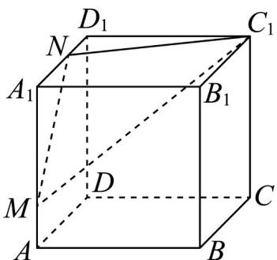
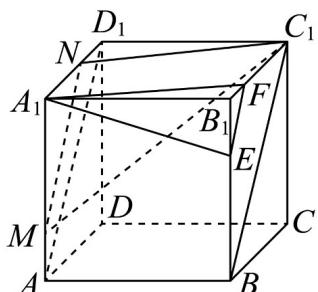

> [!faq]- 《专题8.5 空间直线、平面的平行（高效培优讲义）》官方解析
>
> > [!success]- **【答案】**  A. $\sqrt{10}$ B. 3 C. $\frac{3\sqrt{6}}{2}$ D. $\frac{\sqrt{38}}{2}$
>
> > [!note]- **【分析】**
> > 在 $B_{1}B, B_{1}C_{1}$ 上取点 $E, F$ ，使得 $BB_{1} = 3EB_{1}, B_{1}C_{1} = 3B_{1}F$ ，证得平面 $A_{1}EF // \text{平面 } C_{1}MN$ ，得到点 $Q$ 的轨迹为线段 $EF$ ，在等腰三角形 $A_{1}EF$ 中，求得底边 $EF$ 上的高，即可求解·
>
> > [!note]- **【解析】**
> > 在 $B_{1}B, B_{1}C_{1}$ 上取点 E, F ，使得 $BB_{1} = 3EB_{1}, B_{1}C_{1} = 3B_{1}F$
> >
> > 分别连结 $EF, BC_{1}, AD_{1}$
> >
> > 因为 $A_{1}D_{1}=3D_{1}N$ ，可得 $A_{1}N//C_{1}F$ ，且 $A_{1}N=C_{1}F$ ，
> >
> > 所以四边形 $A_{1}FC_{1}N$ 为平行四边形，所以 $C_{1}N // A_{1}F$
> >
> > 由 $BB_{1} = 3EB_{1}$ 且 $B_{1}C_{1} = 3B_{1}F$ ，可得 $EF / / BC_{1}$
> >
> > 又由 $AA_{1} = 3AM$ 且 $A_{1}D_{1} = 3D_{1}N$ ，所以 $MN / / AD_{1}$
> >
> > 在正方体 $ABCD-A_{1}B_{1}C_{1}D_{1}$ 中，可得 $AD_{1}//BC_{1}$ ，所以 EF//MN
> >
> > 因为 $A_{1}F \notin$ 平面 $C_{1}MN$ ，且 $C_{1}N \subset$ 平面 $C_{1}MN$ ，所以 $A_{1}F //$ 平面 $C_{1}MN$ ，
> >
> > 同理可证 EF // 平面 $C_{1}MN$
> >
> > 又因为 $A_{1}F \cap EF = F$ ，且 $A_{1}F, EF \subset$ 平面 $A_{1}EF$ ，所以平面 $A_{1}EF //$ 平面 $C_{1}MN$ ，
> >
> > 因此点Q的轨迹为线段EF，
> >
> > 在等腰三角形 $A_{1}EF$ 中， $A_{1}F = A_{1}E = \sqrt{10}, EF = \sqrt{2}$
> >
> > 可得底边 $EF$ 上的高为 $\sqrt{A_1F^2 - (\frac{EF}{2})^2} = \frac{\sqrt{38}}{2}$ ，此即为 $A_1Q$ 长度的最小值·故选：D.
> >
> > 
