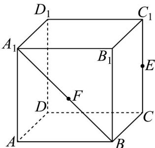
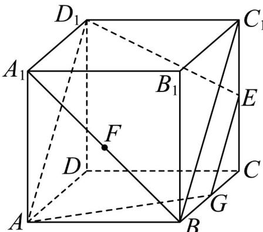
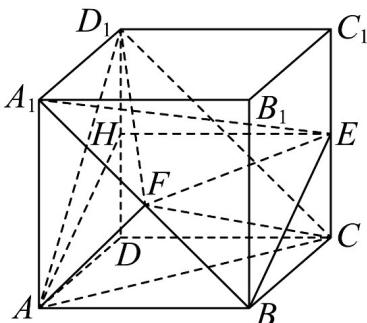
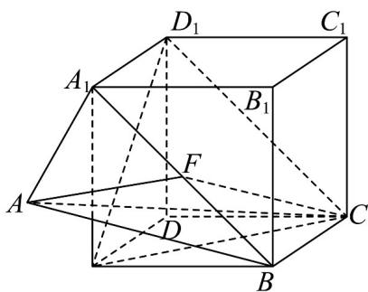

## 题型09 空间平行的转化

【典例1】如图，在棱长为 $2$ 的正方体中 $ABCD - A_{1}B_{1}C_{1}D_{1}$ ， $E$ 为线段 $CC_{1}$ 的中点， $F$ 为线段 $A_{1}B$ 上的动点

(含端点)，则下列结论正确的有（）

A. 过 $A, D_{1}, E$ 三点的平面截正方体 $ABCD - A_{1}B_{1}C_{1}D_{1}$ 所得的截面的面积为 $\frac{9}{2}$

B．存在点 F，使得直线 $EF \parallel$ 平面 $AD_{1}C$

C．当 F 在线段 $A_{1}B$ 上运动时，三棱锥 $C-AFD_{1}$ 的体积不变

D. $FA + FC$ 的最小值为 $2\sqrt{2 + \sqrt{2}}$

【答案】ACD

【分析】根据正方体的性质，结合线面平行、面面平行的判定定理和性质定理逐项判定可①②③确定 $ABC$ 的

正误，利用展开法和点距离的三角不等式，结合余弦定理计算可求得 $FA + FC$ 的最小值，进而判定D.

【详解】对于 A

∵正方体的对面互相平行，

∴过 $A, D_{1}, E$ 三点的平面截正方体 $ABCD - A_{1}B_{1}C_{1}D_{1}$ 的对面 $ADD_{1}A_{1}, BCC_{1}B_{1}$ 所得截线互相平行，

又∵E为线段 $CC_{1}$ 的中点，∴截面交BC于其中点G，

连接 AG, GE, $ED_{1}$ , $D_{1}A$ ，则四边形 $AD_{1}EG$ 即为所求截面，显然为等腰梯形，

且 $AD_{1} = 2\sqrt{2}, EG = \sqrt{2}, AG = D_{1}E = \sqrt{2^{2} + 1^{2}} = \sqrt{5}$

梯形的高 $h = \sqrt{AG^2 - \left(\frac{AD_1 - EG}{2}\right)^2} = \sqrt{5 - \left(\frac{\sqrt{2}}{2}\right)^2} = \frac{3\sqrt{2}}{2}$

面积为 $S=\frac{(AD_{1}+EG)h}{2}=\frac{(2\sqrt{2}+\sqrt{2})\cdot\frac{3\sqrt{2}}{2}}{2}=\frac{9}{2}$ ，故 A 正确；

如图所示，设 H 为 $DD_{1}$ 的中点，

因为 $A_{1}B // D_{1}C$ ， $A_{1}B \notin$ 平面 $AD_{1}C$ ， $D_{1}C \subset$ 平面 $AD_{1}C$ ，所以 $A_{1}B //$ 平面 $AD_{1}C$ ，

假设直线 EF // 平面 $AD_{1}C$ ，

又因为 $A_{1}B \cap EF = F, A_{1}B, EF \subset$ 平面 $A_{1}BE$ ，所以平面 $A_{1}BE //$ 平面 $AD_{1}C$ ，

又因为 $BE \subset$ 平面 $A_{1}BE$ ，所以 $BE \parallel$ 平面 $AD_{1}C$ ，

因为 $H, E$ 分别为正方形 $DD_{1}C_{1}C$ 的边 $DD_{1}, CC_{1}$ 的中点，所以 $HE // DC, HE = DC$

又因为 $DC \parallel AB, DC = AB$ ，所以 $HE \parallel AB, HE = AB$

所以四边形 HEBA 是平行四边形，所以 BE // AH

而直线 AH 与平面 $AD_{1}C$ 相交，所以直线 BE 与平面 $AD_{1}C$ 相交，

这与 $BE //$ 平面 $AD_{1}C$ 矛盾，故假设直线 $EF //$ 平面 $AD_{1}C$ 不成立，故 ${}^{\mathrm{B}}$ 错误

$\because A_{1}B//D_{1}C,\ D_{1}C\subset$ 平面 $AD_{1}C,\ A_{1}B$ 不在平面 $AD_{1}C$ 内，

$\therefore A_{1}B//$ 平面 $AD_{1}C$

又∵ $F\in A_{1}B$ ，∴F到平面 $AD_{1}C$ 的距离为定值，又∵ $\triangle AD_{1}C$ 的面积为定值，

∴当 F 在线段 $A_{1}B$ 上运动时，三棱锥 $C-AFD_{1}$ 的体积不变，故 C 正确；

将等腰直角三角形 $A_{1}AB$ 展开到与矩形 $A_{1}D_{1}CB$ 在同一平面内，

$FA + FC\quad AC = \sqrt{2^2 + 2^2 - 2 \times 2 \times 2 \times \left(-\frac{\sqrt{2}}{2}\right)} = 2\sqrt{2 + \sqrt{2}}$

当 A, F, C 共线时取等号，故 D 正确.

故选：ACD.

![[高中/课堂同步/题库/人教A版高中数学同步讲义(2026)/02_必修第二册/第八章 立体几何初步/专题8.5 空间直线、平面的平行（高效培优讲义）/题型09_空间平行的转化/questions/Q00069849.md]]
![[高中/课堂同步/题库/人教A版高中数学同步讲义(2026)/02_必修第二册/第八章 立体几何初步/专题8.5 空间直线、平面的平行（高效培优讲义）/题型09_空间平行的转化/questions/Q00069850.md]]
![[高中/课堂同步/题库/人教A版高中数学同步讲义(2026)/02_必修第二册/第八章 立体几何初步/专题8.5 空间直线、平面的平行（高效培优讲义）/题型09_空间平行的转化/questions/Q00069851.md]]
