<!-- source-part:1 pages:1-50 -->

## 专题8.6 空间直线、平面的垂直

## 教学目标、教学重难点

<table><tr><td>教学目标</td><td>1.掌握空间中直线与直线垂直的定义(含异面直线垂直的判定:所成角为 $90^{\circ}$ ),能准确求解异面直线所成角的大小(取值范围 $0^{\circ}<\theta\leq90^{\circ}$ )。2.理解直线与平面垂直的定义(直线垂直于平面内任意一条直线),熟练掌握线面垂直的判定定理(一条直线与平面内两条相交直线都垂直,则直线与平面垂直)及性质定理(垂直于同一平面的两条直线平行)。3.明确平面与平面垂直的定义(两平面所成二面角为直二面角),掌握面面垂直的判定定理(一个平面过另一个平面的垂线,则两平面垂直)与性质定理(两平面垂直,一个平面内垂直于交线的直线垂直于另一个平面)。</td></tr><tr><td>教学重难点</td><td>1.重点三大判定定理的探究与应用:线面垂直判定定理的条件(“两条相交直线”的关键作用)、面面垂直判定定理的“线面垂直推面面垂直”逻辑,以及定理在证明中的灵活运用。2.难点判定定理的探究过程:线面垂直判定定理中“用两条相交直线代替无数条直线”的“有限代替无限”思想,学生难以自主突破思维障碍;面面垂直判定定理的发现过程(如何从线面垂直自然过渡到面面垂直)。</td></tr></table>

## 知识清单

## 知识点 01 异面直线所成的角

1、定义：已知两条异面直线 $a$ ， $b$ ，经过空间任一点 $O$ 作直线 $a^{\prime} / / a$ ， $b^{\prime} / / b$ ，则 $a^{\prime}$ 与 $b^{\prime}$ 所成的锐角（或直

角）叫做异面直线 $a$ 与 $b$ 所成的角（或夹角）.

2、异面直线所成的角 $\theta$ 的取值范围： $0^{\circ} < \theta \leq 90^{\circ}$

3、如果两条异面直线 $a$ ， $b$ 所成的角是直角，就说这两条直线互相垂直，记作 $a \perp b$ 。

## 【即学即练】

1. 如图，在正四面体 $A - BCD$ 中， $M, N$ 分别是 $BC$ 与 $AD$ 的中点，设 $AM$ 和 $CN$ 所成角为 $\alpha$ ，则 $\cos \alpha$ 的值

为（）

A. $\frac{2}{3}$ B. $\frac{1}{3}$ C. $\frac{3}{4}$ D. $\frac{1}{4}$

【答案】A

【分析】根据异面直线所成角的定义，借助平行关系作平行线，从而找到异面直线所成角（或补角）即可求。
【详解】如图，连接 MD，设 O 为 MD 的中点，连接 ON、OC，则 $ON = \frac{1}{2} AM$ 且 ON // AM，

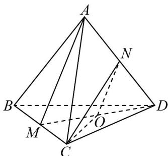

所以 $\angle ONC$ 为异面直线 $AM$ 与 $CN$ 所成的角（或补角），若四面体的棱长为 $1$ ，则 $AM = CN = DM = \frac{\sqrt{3}}{2}$

所以 $ON = \frac{1}{2} AM = \frac{\sqrt{3}}{4}$ ， $MO = \frac{1}{2} DM = \frac{\sqrt{3}}{4}$ ， $OC = \sqrt{MC^2 + MO^2} = \sqrt{\frac{1}{4} + \frac{3}{16}} = \frac{\sqrt{7}}{4}$

在 $\triangle CON$ 中 $\cos \angle ONC = \frac{ON^2 + CN^2 - OC^2}{2ON\cdot CN} = \frac{\frac{3}{16} + \frac{3}{4} - \frac{7}{16}}{2\times\frac{\sqrt{3}}{4}\times\frac{\sqrt{3}}{2}} = \frac{2}{3}$ ，即 $\cos \alpha = \frac{2}{3}\cdot$

故选：A

2. 如图，在正方体 $ABCD - A_{1}B_{1}C_{1}D_{1}$ 中，异面直线 $A_{1}C_{1}$ 与 $BC$ 所成的角是（）

【答案】

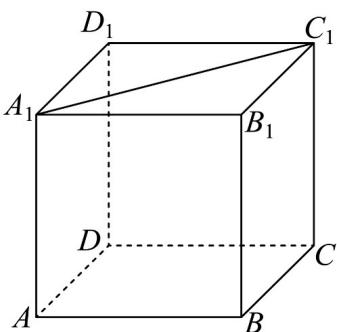

A: $30^{\circ}$ B: $45^{\circ}$ C: $60^{\circ}$ D: $90^{\circ}$

【答案】B

【分析】利用几何法确定异面直线夹角·

【详解】由正方体可知 $BC // B_{1}C_{1}$ ，且四边形 $A_{1}B_{1}C_{1}D_{1}$ 为正方形，

所以异面直线 $A_{1}C_{1}$ 与 BC 所成的角的平面角为 $\angle A_{1}C_{1}B_{1}=45^{\circ}$

故选：B.

## 知识点 02 直线与平面垂直的定义与判定

1、直线和平面垂直的定义

如果直线 $l$ 和平面 $\alpha$ 内的任意一条直线都垂直，我们就说直线 $l$ 与平面 $\alpha$ 互相垂直，记作 $l \perp \alpha$ 。直线 $l$ 叫平

面 $\alpha$ 的垂线；平面 $\alpha$ 叫直线 $l$ 的垂面；垂线和平面的交点叫垂足．垂线上任意一点到垂足间的线段，叫做这

个点到这个平面的垂线段．垂线段的长度叫做这个点到平面的距离．

知识点诠释：

（1）定义中的“任何直线”与“所有直线”是同义语，定义是说这条直线和平面内所有直线垂直。

(2) 直线和平面垂直是直线和平面相交的一种特殊形式.

（3）如果一条直线垂直于一个平面，那么它就和平面内的任意一条直线垂直，简述之，即“线面垂直，则线

线垂直”，这是我们判定两条直线垂直时经常使用的一种重要方法．画直线和平面垂直时，通常要把直线画成

和表示平面的平行四边形的一边垂直，如图所示．符号语言描述： $l \perp \alpha$

（4）在平面几何中，我们有命题：经过一点有且只有一条直线与已知直线垂直，在本节中，也有类似的命题。

命题1：过一点有且只有一条直线和已知平面垂直.

命题2：过一点有且只有一个平面和已知直线垂直.

2、直线和平面垂直的判定定理

文字语言：一条直线与一个平面内的两条相交直线都垂直，则该直线与此平面垂直。

图形语言：

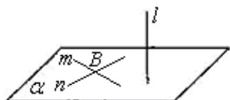

$$
\left. \begin{array}{l} m \subset \alpha , n \subset \alpha , m   \text {I}    n = B \\ l \perp m, l \perp n \end{array} \right\} \Rightarrow l \perp \alpha
$$

特征：线线垂直 $\Rightarrow$ 线面垂直

知识点诠释：

（1）判定定理的条件中：“平面内的两条相交直线”是关键性词语，不可忽视。

(2) 要判定一条已知直线和一个平面是否垂直，取决于在这个平面内能否找出两条相交直线和已知直线垂直，

至于这两条相交直线是否和已知直线有公共点，则无关紧要。

相关的重要结论

①过一点与已知直线垂直的平面有且只有一个；过一点与已知平面垂直的直线有且只有一条。

②如果两条平行线中的一条与一个平面垂直，那么另一条也与这个平面垂直。

③如果两个平行平面中的一个与一条直线垂直，那么另一个也与这条直线垂直。

【即学即练】

1. 如图，在四棱锥 $P - ABCD$ 中， $PA \perp$ 平面 $ABCD$ ， $E$ 为 $PD$ 的中点， $AD // BC$ ， $\angle BAD = 90^\circ$

$PA = AB = BC = 1$ $AD = 2$

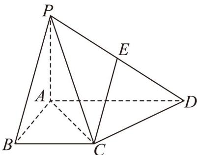

(1)求证： $DC\perp$ 平面PAC；

(2)求直线 $EC$ 与平面 $PAC$ 所成角的正弦值·

【答案】(1)证明见解析 (2) $\frac{\sqrt{10}}{5}$

【分析】（1）由线面垂直的性质得到 $PA \perp CD$ ，再由勾股定理逆定理得到 $DC \perp AC$ ，即可得证；

(2) 取 $PC$ 的中点 $F$ ，连接 $EF$ ，即可得到 $EF \perp$ 平面 $PAC$ ，从而得到 $\angle ECF$ 为直线 $EC$ 与平面 $PAC$ 所成的

角，再由锐角三角函数计算可得·

【详解】（1）因为 $PA \perp$ 平面ABCD， $CD \subset$ 平面ABCD，所以 $PA \perp CD$

又四边形 $ABCD$ 为直角梯形，且 $\angle ABC = \angle BAD = 90^{\circ}$ ， $BC = \frac{1}{2} AD$

则 $AC^{2}=AB^{2}+BC^{2}=2$ ，所以 $AC=\sqrt{2}$ ，

因为 $AB = BC = 1$ ，所以 $\angle BAC = 45^{\circ}$ ，所以 $\angle DAC = 45^{\circ}$

在 $\triangle ACD$ 中，由余弦定理可得 $CD^2 = AC^2 + AD^2 - 2AC \cdot AD \cdot \cos \angle DAC = 2$

所以 $AC^2 + CD^2 = AD^2$ ，即 $DC \perp AC$

因为 $AC \cap PA = A$ ，AC， $PC \subset$ 平面 PAC，所以 $DC \perp$ 平面 PAC。

(2) 取 PC 的中点 F，连接 EF，

因为 E 为 PD 的中点，所以 $EF \parallel CD$ ，由（1）知 $DC \perp$ 平面 PAC，则 $EF \perp$ 平面 PAC

所以 $\angle ECF$ 为直线 EC 与平面 PAC 所成的角.

又 $CF \subset$ 平面 PAC ，所以 $EF \perp CF$

因为 $CF = \frac{1}{2} PC = \frac{1}{2}\sqrt{1^2 + (\sqrt{2})^2} = \frac{\sqrt{3}}{2}, EF = \frac{1}{2} CD = \frac{\sqrt{2}}{2}$

又 $CE = \sqrt{CF^2 + FE^2} = \frac{\sqrt{5}}{2}$

所以 $\sin\angle ECF=\frac{EF}{CE}=\frac{\frac{\sqrt{2}}{2}}{\frac{\sqrt{5}}{2}}=\frac{\sqrt{10}}{5}$

所以直线 $EC$ 与平面 $PAC$ 所成角的正弦值为 $\frac{\sqrt{10}}{5}$

2．如图，在直三棱柱 $ABC-A_{1}B_{1}C_{1}$ 中， $AB\perp BC$ ， $AA_{1}=AC=2$ ，BC=1，E，F分别是 $A_{1}C_{1}$ ，AB 的中点·

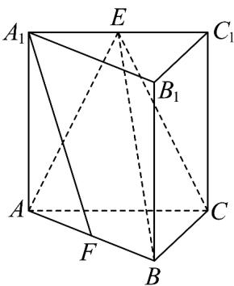

(1)求证： $BC\perp$ 平面 $A_{1}ABB_{1}$

(2)求证： $A_{1}F //$ 平面 BCE；

(3)求点 B 到平面 ACE 的距离.

【答案】(1)证明见解析 (2)证明见解析 (3) $\frac{\sqrt{3}}{2}$

【分析】（1）由 $AA_{1} \perp$ 平面 ABC 得 $AA_{1} \perp BC$ ，结合 $AB \perp BC$ 利用线面垂直的判定定理可证；

(2) 取 $D$ 为 $BC$ 的中点，连接 $DF, DE$ ，先证明四边形 $DFA_{1}E$ 为平行四边形，再利用线面平行的判定定理可

证；

(3) 利用等体积法计算出三棱锥 B-ACE 的体积，再求出 $\triangle ACE$ 的面积，即可求得点 B 到平面 ACE 的距离.

【详解】（1）在直三棱柱 $ABC - A_{1}B_{1}C_{1}$ 中， $AA_{1} \perp$ 平面 $ABC$ ， $BC \subset$ 平面 $ABC$ ，所以 $AA_{1} \perp BC$

又 $AB \perp BC$ ， $AA_{1} \cap AB = A$ ， $AB$ 、 $AA_{1} \subset$ 平面 $A_{1}ABB_{1}$ ，所以 $BC \perp$ 平面 $A_{1}ABB_{1}$

(2) 取 D 为 BC 的中点，连接 DF, DE，因为 F 是 AB 的中点，故 $DF \parallel AC$ ，且 $DF = \frac{1}{2} AC$

又 $AC / / A_{1}C_{1}$ ，且 $AC = A_{1}C_{1}$ ，所以 $DF / / A_{1}C_{1}$ ，且 $DF = \frac{1}{2} A_{1}C_{1}$

又 $AE = \frac{1}{2} A_{1}C_{1}$ ，所以 $DF / / A_{1}E$ ，且 $DF = A_{1}E$ ，所以四边形 $DFA_{1}E$ 为平行四边形，

所以 $DE \parallel A_{1}F$ ，而 $DE \subset$ 平面 BCE， $A_{1}F \not\subset$ 平面 BCE， $A_{1}F \parallel$ 平面 BCE；

(3) 由题意 $AB \perp BC$ ， $AC = 2$ ， $BC = 1$ ，所以 $AB = \sqrt{2^2 - 1^2} = \sqrt{3}$

因为 E 是 $A_{1}C_{1}$ 的中点， $AA_{1} \perp$ 平面 ABC，

所以 $V_{E-ABC}=\frac{1}{3}S_{\triangle ABC}\cdot AA_{1}=\frac{1}{3}\times\frac{1}{2}\times1\times\sqrt{3}\times2=\frac{\sqrt{3}}{3}$ ，所以 $V_{B-ACE}=V_{E-ABC}=\frac{\sqrt{3}}{3}$

又 $S_{\triangle ACE} = \frac{1}{2} AC\cdot AA_1 = \frac{1}{2}\times 2\times 2 = 2$

设点 B 到平面 ACE 的距离为 d，则 $V_{B-ACE} = \frac{1}{3} \times 2 \times d = \frac{\sqrt{3}}{3}$ ，解得 $d = \frac{\sqrt{3}}{2}$ ，所以点 B 到平面 ACE 的距离为 $\frac{\sqrt{3}}{2}$ 。

## 知识点 03 直线与平面所成的角

1、如图，一条直线 $PA$ 和一个平面 $\alpha$ 相交，但不和这个平面垂直，这条直线叫做这个平面的斜线，斜线和平

面的交点 $A$ 叫做斜足，过斜线上斜足以外的一点向平面引垂线 $PO$ ，过垂足 $O$ 和斜足 $A$ 的直线 $AO$ 叫做斜线

在这个平面上的射影，平面的一条斜线和它在平面上的射影所成的锐角，叫做这条直线和这个平面所成的角。

2、一条直线垂直于平面，称它们所成的角是直角；一条直线在平面内或一条直线和平面平行，称它们所成的

角是 $0^{\circ}$ 的角，于是，直线与平面所成的角 $\theta$ 的范围是 $0^{\circ} \leq \theta \leq 90^{\circ}$

【即学即练】

1. 已知正方体 $ABCD - A_{1}B_{1}C_{1}D_{1}$ 中，点 $E, F, G$ 分别为棱 $AB, AA_{1}, C_{1}D_{1}$ 的中点，给出下列四个结论：

其中不正确结论是（ ）

A. 直线 $FG$ 与平面 $ACD_{1}$ 相交；

B. $B_{1}D \perp$ 平面 EFG ;

C. 若 $AB = 1$ ，则点 $D$ 到平面 $ACD_{1}$ 的距离为 $\frac{\sqrt{3}}{3}$ ；

D．该正方体的棱所在直线与平面 EFG 所成的角都相等．

【答案】A

【分析】①先证 $AD_{1} // EG, EF // CD_{1}$ ，可得平面 EFG // 平面 $ACD_{1}$ ，从而知 FG // 平面 $ACD_{1}$ ，可判断 A 的真

假；②利用三垂线定理可得 $B_{1}D \perp AC, B_{1}D \perp CD_{1}$ ，再由线面垂直的判定定理知 $B_{1}D \perp \text{平面 } ACD_{1}$ ，并结合平

面 $EFG //$ 平面 $ACD_{1}$ ，可判断 $\mathsf{B}$ 的真假；③易知 $\triangle ACD_{1}$ 是边长为 $\sqrt{2}$ 的等边三角形，再利用等体积法可求点到

面的距离，判断 $^{C}$ 的真假；④结合四面体 $D-ACD_{1}$ 是正三棱锥，且正方体的棱构成三组平行线，即可判断 $^{D}$

的真假.

【详解】①因为点 E, G 分别为棱 AB, $C_{1}D_{1}$ 的中点，

所以 $AE \parallel D_{1}G$ , $AE = D_{1}G$ ，即四边形 $AEGD_{1}$ 是平行四边形，

所以 $AD_{1} // EG$

又因为 $AD_{1} \subset$ 平面 $ACD_{1}$ ， $EG \not\subset$ 平面 $ACD_{1}$ ，所以 $EG \parallel$ 平面 $ACD_{1}$ .

因为点 $E, F$ 分别为棱 $AB, AA_{1}$ 的中点，所以 $EF // A_{1}B // CD_{1}$

又因为 $CD_{1} \subset$ 平面 $ACD_{1}$ ， $EF \not\subset$ 平面 $ACD_{1}$ ，所以 $EF \parallel$ 平面 $ACD_{1}$ .

因为 $EG \cap EF = E$ ，EG、EF ⊂ 平面 EFG，

所以平面 EFG // 平面 $ACD_{1}$ .

因为 $FG \subset$ 平面 EFG ，所以直线 $FG \parallel$ 平面 $ACD_{1}$ ，即 A 错误；

②由三垂线定理知， $B_{1}D \perp AC, B_{1}D \perp CD_{1}$

因为 $AC \cap CD_{1} = C, AC, CD_{1} \subset$ 平面 $ACD_{1}$ ，所以 $B_{1}D \perp$ 平面 $ACD_{1}$ ，

由①知平面 $EFG \parallel$ 平面 $ACD_{1}$ ，所以 $B_{1}D \perp$ 平面 EFG，即 B 正确；

③若 $AB = 1$ ，则 $\triangle ACD_{1}$ 是边长为 $\sqrt{2}$ 的等边三角形，所以 $S_{\triangle ACD_1} = \frac{1}{2}\times \sqrt{2}\times \sqrt{2}\times \sin \frac{\pi}{3} = \frac{\sqrt{3}}{2}$

设点D到平面 $ACD_{1}$ 的距离为d，

因为 $V_{D-ACD_{1}} = V_{D_{1}-ACD}$ ，所以 $\frac{1}{3}d \cdot S_{\triangle ACD_{1}} = \frac{1}{3} \cdot DD_{1} \cdot S_{\triangle ACD}$ ，所以 $d = \frac{1 \times \frac{1}{2} \times 1 \times 1}{\frac{\sqrt{3}}{2}} = \frac{\sqrt{3}}{3}$ ，

$$
\sqrt {3}
$$

所以点 D 到平面 $ACD_{1}$ 的距离为 $\overline{3}$ ，即 C 正确；

④由题意知，四面体 $D - ACD_{1}$ 的底面是等边 $\triangle ACD_{1}$ ，且 $DA = DC = DD_{1}$

即四面体 $D - ACD_{1}$ 是正三棱锥，

所以三条侧棱 DA, DC, $DD_{1}$ 与底面 $ACD_{1}$ 所成角均相等，

而 $DA\parallel D_1A_1\parallel CB\parallel C_1B_1$ ， $DC\parallel D_1C_1\parallel AB\parallel A_1B_1$ ， $DD_{1}\parallel AA_{1}\parallel BB_{1}\parallel CC_{1}$

所以该正方体的棱所在直线与平面 $ACD_{1}$ 所成的角都相等，

由①知平面 $EFG //$ 平面 $ACD_{1}$

所以该正方体的棱所在直线与平面 EFG 所成的角都相等，即 D 正确。

故选：A

2. 如图，在四棱锥 $P - ABCD$ 中，底面 $ABCD$ 是边长为 2 的正方形，点 $E, F$ 分别是 $BD, AP$ 的中点.

(1)证明： $EF \parallel$ 平面PBC；

(2)若 $PA = PC = 2\sqrt{2}$ ，求直线 $PC$ 与平面 $PBD$ 所成角的大小.

【答案】(1)证明见解析 (2) $\frac{\pi}{6}$

【分析】（1）连接 $AC$ ，利用三角形中位线定理证明 $EF//PC$ ，再由线线平行证线面平行即可·

(2) 先证明 $AC \perp$ 平面 PBD，即得 $\angle CPE$ 为直线 PC 与平面 PBD 所成角，借助于 $Rt^{\triangle} CPE$ ，即可求得答案.

【详解】（1）如图，连接 $AC$ ，因为四边形ABCD是正方形，所以点 $E$ 是 $AC$ 的中点，

又因 F 是 AP 的中点，故得 $EF \parallel PC$ ，

又因 $EF \notin$ 平面 $PBC$ ， $PC \subset$ 平面 $PBC$ ，所以 $EF //$ 平面 $PBC$

(2) 如图，连接 $EP$ ，由 (1) 得 $E$ 是 $AC$ 中点，

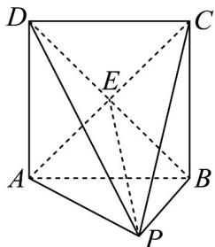

因为 PA = PC ，所以 $EP \perp AC$ ，

又因为底面 $ABCD$ 是正方形，且 $AC, BD$ 为对角线，所以 $BD \perp AC$

又因为 BDI $EP = E, BD, EP \subset$ 平面 PBD ，所以 $AC \perp$ 平面 PBD

所以直线 $PC$ 与平面 $PBD$ 所成角为 $\angle CPE$

因为在 $\mathrm{Rt}^{\triangle}$ CPE中， $CE = \sqrt{2}, PC = 2\sqrt{2}$ ，则 $\sin \angle CPE = \frac{CE}{PC} = \frac{1}{2}$

故 $\angle CPE = \frac{\pi}{6}$ ，即直线 $PC$ 与平面 $PBD$ 所成角的大小为 $\frac{\pi}{6}$

## 知识点 04 直线与平面垂直的性质

## 1、基本性质

文字语言：一条直线垂直于一个平面，那么这条直线垂直于这个平面内的所有直线。

符号语言： $l\perp \alpha ,m\subset \alpha \Rightarrow l\perp m$

图形语言：

2、性质定理

文字语言：垂直于同一个平面的两条直线平行。

符号语言： $l\perp \alpha ,m\perp \alpha \Rightarrow l / / m$

图形语言：

【即学即练】

1. 如图， $PA \perp$ 矩形 ABCD 所在的平面，M, N 分别是 AB, PC 的中点.

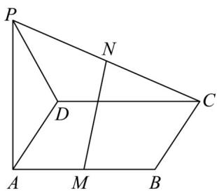

(1)求证： $MN / /$ 平面PAD；

(2)若 $PD$ 与平面 $ABCD$ 所成的角为 $\alpha$ ，当 $\alpha$ 为多少度时， $MN \perp$ 平面 $PCD?$

【答案】(1)证明见解析 (2) $\frac{\pi}{4}$

【分析】（1）取 $PD$ 的中点 $E$ ，连接 $NE, AE$ ，利用几何关系得 $MN // AE$ ，再利用线面平行的判定，即可求

解；

(2) 利用线面角的定义，知 $\angle PDA$ 即为 $PD$ 与平面 $ABCD$ 所成的角，从而 $\alpha = 45^{\circ}$ 时， $AE \perp PD$ ，进而可得

$MN \perp PD$ ，再由线面垂直的性质和线面垂直的判定得 $CD \perp MN$ ，再由线面垂直的判定，即可求解

【详解】（1）取 $PD$ 的中点 $E$ ，连接 $NE, AE$ ，如图，

因为 N 是 PC 的中点，所以 $NE \parallel DC$ 且 $NE = \frac{1}{2} DC$ ，

又因为 DC // AB 且 DC = AB ， $AM = \frac{1}{2} AB$ ，

所以 $AM / / CD$ 且 $AM = \frac{1}{2} CD$ ，所以 $NE / / AM$ ，且 $NE = AM$ ，

所以四边形 AMNE 是平行四边形，则 $MN \parallel AE$ ，

又 $AE \subset$ 平面 PAD ， $MN \not\subset$ 平面 PAD ， 所以 MN // 平面 PAD ·

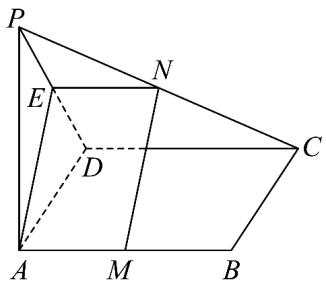

(2) $\alpha = 45^{\circ}$ 时， $MN \perp$ 平面 $PCD$ ，证明如下，

因为 $PA \perp$ 平面 $ABCD$ ，所以 $\angle PDA$ 即为 $PD$ 与平面 $ABCD$ 所成的角，

当 $\angle PDA = 45^{\circ}$ 时，则 AP = AD ，所以 $AE \perp PD$

又由 $(1)$ 知 $MN // AE$ ，所以 $MN \perp PD$ ，

因为 $PA \perp$ 平面 ABCD ， $CD \subset$ 平面 ABCD ，所以 $PA \perp CD$

又∵CD⊥AD，PA∩AD=A，PA,AD⊂平面PAD，

$\therefore CD \perp$ 平面 PAD， $\because AE \subset$ 平面 PAD， $\therefore CD \perp AE$ ， $\therefore CD \perp MN$

又 $CD \cap PD = D, CD, PD \subset$ 平面 $PCD$ ，所以 $MN \perp$ 平面 $PCD$ .

2. 在边长为 1 的正方体 $ABCD-A_{1}B_{1}C_{1}D_{1}$ 中，下列选项中，正确的是（）

【答案】

A. $A_{1}C_{1}\perp BD$ B. $B_{1}C$ 与 BD 所成的角为 $60^{\circ}$ C. $A_{1}C$ 与平面 ABCD 所成的角为 $45^{\circ}$ D. 三棱锥 $A_{1}-ABD$ 的外接球半径为 $\frac{\sqrt{3}}{2}$

【答案】ABD

【分析】选项 A，由 $AC \perp BD$ 和 $AC // A_{1}C_{1}$ 得到 $A_{1}C_{1} \perp BD$ ；选项 B，由 $A_{1}D // B_{1}C$ 得到 $\angle A_{1}DB$ 为 $B_{1}C$ 和 BD 所成的角，又 $\triangle A_{1}DB$ 为等边三角形得到 $B_{1}C$ 和 BD 所成的角为 $60^{\circ}$ ；选项 C， $AA_{1} \perp$ 平面 ABCD 得到 $\angle ACA_{1}$ 为 $A_{1}C$ 与平面 ABCD 所成的角，从而得到 $\tan \angle ACA_{1} \neq 1$ ，则 $\angle ACA_{1} \neq 45^{\circ}$ ；选项 D，由三棱锥 $A_{1}-ABD$ 的外接球

就是正方体 $ABCD - A_{1}B_{1}C_{1}D_{1}$ 的外接球，利用正方体求得三棱锥 $A_{1}-ABD$ 的外接球的半径。

【详解】选项 A，∵ $ABCD - A_{1}B_{1}C_{1}D_{1}$ 是正方体，∴ ABCD 是正方形，∴ $AC \perp BD$

∵ $AC // A_{1}C_{1}$ ，∴ $A_{1}C_{1} \perp BD$ ，∴ 选项 A 正确；

选项 B，∵ $ABCD - A_{1}B_{1}C_{1}D_{1}$ 是正方体，∴ $A_{1}D // B_{1}C$ ，∴ $\angle A_{1}DB$ 为 $B_{1}C$ 和 BD 所成的角，

又 $Q^{\triangle}A_{1}DB$ 为等边三角形， $\therefore\angle A_{1}DB=60^{\circ}$

$\therefore B_{1}C$ 和 BD 所成的角为 $60^{\circ}$ ，∴ 选项 B 正确；

选项 C，∵ $ABCD - A_{1}B_{1}C_{1}D_{1}$ 是正方体，∴ $AA_{1} \perp$ 平面 ABCD，

$\therefore \angle ACA_{1}$ 为 $A_{1}C$ 与平面 ABCD 所成的角，

∵ 正方体 $ABCD - A_{1}B_{1}C_{1}D_{1}$ 的棱长为 1，∴ $AC = \sqrt{2}$

∴ 在 $Rt\triangle ACA_{1}$ 中， $\tan\angle ACA_{1}=\frac{AA_{1}}{AC}=\frac{1}{\sqrt{2}}\neq1$ ， $\therefore\angle ACA_{1}\neq45^{\circ}$ ，∴选项 C 错误；

选项 D，∵ 三棱锥 $A_{1}-ABD$ 的外接球就是正方体 $ABCD-A_{1}B_{1}C_{1}D_{1}$ 的外接球，

∴三棱锥 $A_{1}-ABD$ 的外接球的半径为 $\frac{1}{2}\sqrt{1+1+1}=\frac{\sqrt{3}}{2}$ ，∴选项 D 正确.

故选：ABD.

知识点 05 二面角

1、定义：从一条直线出发的两个半平面所组成的图形叫做二面角，这条直线叫二面角的棱，这两个半平面叫

二面角的面．图中的二面角可记作：二面角 $\alpha-AB-\beta$ 或 $\alpha-l-\beta$ 或 P-AB-Q．

2、二面角的平面角：如图，在二面角 $\alpha - l - \beta$ 的棱 $l$ 上任取一点 $O$ ，以点 $O$ 为垂足，在半平面 $\alpha$ 和 $\beta$ 内分别

作垂直与直线 $l$ 的射线 $OA$ ， $OB$ ，则射线 $OA$ 和 $OB$ 构成的 $\angle AOB$ 叫做二面角的平面角．平面角是直角的二面

角叫做直二面角．

【即学即练】

1. 如图所示，在四棱锥 $P - ABCD$ 中， $PC \perp$ 底面 $ABCD$ ，四边形 $ABCD$ 是直角梯形， $AB \perp AD$ ， $AB // CD$

$PC = AB = 2AD = 2CD = 2$ ， $E_{\text{是}}PB$ 的中点

(1)求证：平面 $EAC \perp$ 平面 $PBC$ .

(2)求二面角 P - AC - E 的余弦值.

(3) 点 F 在直线 PB 上，且 $PD \parallel$ 平面 ACF，求出 PF 的长·

【答案】(1)证明见解析 (2) $\frac{\sqrt{6}}{3}$ (3) $\frac{\sqrt{6}}{3}$

【分析】（1）利用线面垂直的判定定理即可得证；

(2) 由 (1) 可知 $AC \perp$ 平面 $PBC$ 得 $AC \perp PC$ ， $AC \perp CE$ ，即 $\angle PCE$ 为二面角 $P - AC - E$ 的平面角，在 $\triangle PCE$

中利用余弦定理即可求解；

(3) 连接 BD 交 AC 于 O，过 O 作 OF // PD 交 PB 于 F，连接 AF，CF，进而得 PD // 平面 ACF，由

$\frac{OB}{OD}=\frac{AB}{DC}=2$ 结合 $\frac{OB}{OD}=\frac{BF}{PF}$ 即可求解.

【详解】（1）四边形ABCD是直角梯形，AB=2CD=2AD=2

$$
\therefore A C = B C = \sqrt {2} \quad A C \perp B C
$$

∵ $PC \perp$ 平面 ABCD， $AC \subset$ 平面 ABCD

∴ $PC \perp AC$ ，又 $PC \cap BC = C$ ，PC，BC ⊂ 平面 PBC

$\therefore AC \perp$ 平面 PBC，又 $AC \subset$ 平面 EAC，

∴ 平面 $EAC \perp$ 平面 PBC;

(2) 由(1)可知 $AC \perp$ 平面 PBC，

∵ PC，CE ⊂ 平面 PBC，∴ AC ⊥ PC，AC ⊥ CE，∴ ∠PCE 为二面角 P - AC - E 的平面角，

$\because PC = 2, BC = \sqrt{2}, \therefore CE = PE = \frac{1}{2} PB = \frac{1}{2} \cdot \sqrt{4 + 2} = \frac{\sqrt{6}}{2}$

$\therefore \cos \angle PCE = \frac{PC^2 + CE^2 - PE^2}{2PC \cdot CE} = \frac{\sqrt{6}}{3}.$ $\therefore$ 二面角 $P - AC - E$ 的余弦值为 $\frac{\sqrt{6}}{3}$ ;

(3) 连接 BD 交 AC 于 O，过 O 作 OF // PD 交 PB 于 F，连接 AF，CF.

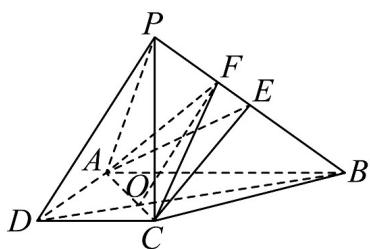

由 $OF \subset$ 平面 ACF， $PD \notin$ 平面 ACF，得 $PD \parallel$ 平面 ACF.

$\because AB // CD, \therefore \frac{OB}{OD} = \frac{AB}{DC} = 2$ ，又 $OF // PD, \therefore \frac{OB}{OD} = \frac{BF}{PF} = 2, \therefore PF = \frac{1}{3} PB = \frac{\sqrt{6}}{3}$ .

2．祈年殿（图1）是北京市的标志性建筑之一，距今已有 $^{600}$ 多年历史·殿内部有垂直于地面的 $^{28}$ 根木柱，
分三圈环形均匀排列·内圈有 $^{4}$ 根约为 $^{19}$ 米的龙井柱，寓意一年四季；中圈有 $^{12}$ 根约为 $^{13}$ 米的金柱，代表十二个月；外圈有 $^{12}$ 根约为6米的檐柱，象征十二个时辰·已知由一根龙井柱 $AA_{1}$ 和两根金柱 $BB_{1}$ ， $CC_{1}$ 形成的几何体 $ABC-A_{1}B_{1}C_{1}$ （图2）中， $AB=AC\approx8$ 米， $\angle BAC\approx144^{\circ}$ ，则平面 $A_{1}B_{1}C_{1}$ 与平面ABC所成角的正切值约为（）

图1

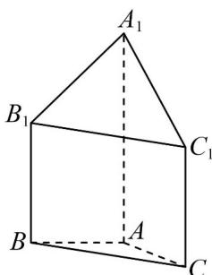
图2

A. $\frac{7}{8\sin18^{\circ}}$ B. $\frac{3}{4\sin18^{\circ}}$ C. $\frac{7}{8\cos18^{\circ}}$ D. $\frac{3}{4\cos18^{\circ}}$

【答案】B

【分析】若平面 $ABC / /$ 平面 $DB_{1}C_{1}$ ， $E$ 是 $B_{1}C_{1}$ 的中点，连接 $DE, A_{1}E$ ，从而得到 $\angle A_{1}ED$ 是平面 $A_{1}B_{1}C_{1}$ 与平面 $DB_{1}C_{1}$ 所成角的平面角，即为所求角，结合已知求其正切值·
【详解】过 $B_{1}C_{1}$ 作平面 $DB_{1}C_{1} / /$ 平面 $ABC$ ，交 $AA_{1}$ 于点 $D$

则平面 $A_{1}B_{1}C_{1}$ 与平面 $ABC$ 所成角，即为平面 $A_{1}B_{1}C_{1}$ 与平面 $DB_{1}C_{1}$ 所成角，

由题意有 $\triangle ABC \cong \triangle DB_{1}C_{1}$ ，即 $\triangle DB_{1}C_{1}$ 是等腰三角形，腰长约为 8 米， $\angle B_{1}DC_{1} \approx 144^{\circ}$ ，易知

$$
\angle D B _ {1} C _ {1} = \angle D C _ {1} B _ {1} \approx 1 8 ^ {\circ}
$$

若 $E$ 是 $B_{1}C_{1}$ 的中点，连接 $DE, A_{1}E$ ，则 $DE \perp B_{1}C_{1}$ ，且 $A_{1}D \perp$ 平面 $DB_{1}C_{1}$

由 $B_{1}C_{1}\subset$ 平面 $DB_{1}C_{1}$ ，则 $A_{1}D\perp B_{1}C_{1}$ ， $DE\cap A_1D = D$ 都在平面 $A_{1}DE$ 内，

所以 $B_{1}C_{1} \perp$ 平面 $A_{1}DE$ ，又 $A_{1}E, A_{1}D \subset$ 平面 $A_{1}DE$ ，

所以 $B_{1}C_{1}\perp A_{1}E,B_{1}C_{1}\perp A_{1}D$ ，又 $B_{1}C_{1}$ 为平面 $A_{1}B_{1}C_{1}$ 与平面 $DB_{1}C_{1}$ 的交线，

则 $\angle A_{1}ED$ 是平面 $A_{1}B_{1}C_{1}$ 与平面 $DB_{1}C_{1}$ 所成角的平面角，

其中 $A_{1}D=19-13=6$ ， $DE=8\sin18^{\circ}$ ，则 $\tan\angle A_{1}ED=\frac{A_{1}D}{DE}=\frac{3}{4\sin18^{\circ}}$

故选：B

## 知识点 06 平面与平面垂直的定义与判定

1、平面与平面垂直定义

定义：两个平面相交，如果它们所成的二面角是直二面角，就说这两个平面垂直。

表示方法：平面 $\alpha$ 与 $\beta$ 垂直，记作 $\alpha \perp \beta$

画法：两个互相垂直的平面通常把直立平面的竖边画成与水平平面的横边垂直．如图：

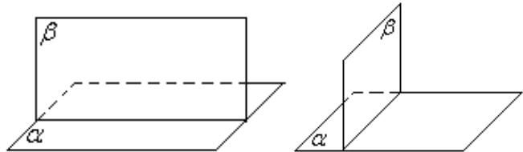

2、平面与平面垂直的判定定理

文字语言：一个平面过另一个平面的垂线，则这两个平面垂直。

符号语言： $l\perp \alpha ,l\subset \beta \Rightarrow \alpha \perp \beta$

图形语言：

特征：线面垂直 $\Rightarrow$ 面面垂直

知识点诠释：平面与平面垂直的判定定理告诉我们，可以通过直线与平面垂直来证明平面与平面垂直。通常

我们将其记为“线面垂直，则面面垂直”。因此，处理面面垂直问题转化为处理线面垂直问题，进一步转化为

处理线线垂直问题．以后证明平面与平面垂直，只要在一个平面内找到两条相交直线和另一个平面内的一条

直线垂直即可.

【即学即练】

1. 如图，在四棱锥 $S - ABCD$ 中，底面 $ABCD$ 为直角梯形， $AD // BC, AB \perp BC$ ，平面 $SBC \perp$ 平面 $SAB$ ， $AB = AS, BC = 2AD$

(1)求证：平面 $SAB \perp$ 平面 ABCD；

(2)若 $\triangle SAB$ 为等边三角形，边长为 $2$ ， $SD$ 与底面 $ABCD$ 所成角为 $\overline{6}$ ，求四棱锥 $S - ABCD$ 的体积.

$$
\frac {\pi}{6}
$$

【答案】(1)证明见解析 (2) $2\sqrt{6}$

【分析】（1）先证明 $BC \perp$ 平面 SAB，再根据面面垂直的判定定理证明面面垂直.

(2) 根据锥体的体积公式求锥体体积·

【详解】（1）如图：

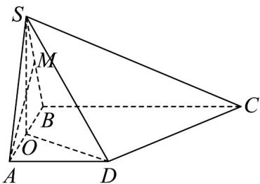

取 $BS$ 中点 $M$ ，连接 $AM$ ， $\because AB = AS, M$ 为中点 $\therefore AM \perp BS$

又∵平面 $SBC \perp$ 平面 SAB ，平面 SBCI 平面 $SAB = BS$ ， $AM \subset$ 平面 SAB

$\therefore AM \perp$ 平面 $SBC$ ，又 $\because BC \subset$ 平面 $SBC \therefore AM \perp BC$

$\therefore AB \perp BC, AM \cap AB = A, AM, AB \subset$ 平面 $SAB$

$\therefore BC \perp$ 平面 $SAB$

又∵ $BC \subset$ 平面ABCD，∴平面 $SAB \perp$ 平面ABCD.

(2) 取 $AB$ 中点 $O$ ，连接 $SO$ ，连接 $DO$ ，同理可证 $SO \perp$ 平面 $ABCD$

则 $\angle ODS$ 为 $SD$ 与底面 $ABCD$ 所成角的平面角.

$\because \Delta SAB$ 为等边三角形，边长为 $2$ ， $\therefore SO = \sqrt{3}$

在 $Rt\triangle SOD$ 中，解得 DO = 3 ，在 $Rt\triangle OAD$ 中，解得 $AD = 2\sqrt{2}$

则 $BC = 4\sqrt{2}$

$$
\therefore S _ {\text {梯形ABCD}} = \frac {1}{2} \Big (4 \sqrt {2} + 2 \sqrt {2} \Big) \times 2 = 6 \sqrt {2}
$$

$$
\therefore V = \frac {1}{3} S _ {\text {梯形} A B C D} \times S O = \frac {1}{3} \times 6 \sqrt {2} \times \sqrt {3} = 2 \sqrt {6}
$$

2．如图1，在矩形ABCD中， $AB=2$ ， $AD=\sqrt{3}$ ，将△BCD沿BD翻折至△BC\_{1}D，且 $AC_{1}=1$ ，如图2所示.

图1

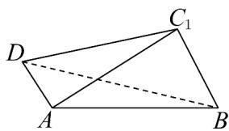
图2

(1)求证：平面 $ABC_{l}\perp$ 平面 $AC_{l}D$ ；

(2)求点 $C_{l}$ 到平面 ABD 的距离 d；

(3)求二面角 $C_1 - BD - A$ 的余弦值.

【答案】(1)证明详见解析 (2) $d = \frac{\sqrt{3}}{2}$ (3) $\frac{3}{4}$

【分析】（1）根据勾股定理可证 $AC_{1} \perp BC_{1}$ ，再结合线面垂直的判定定理可证 $BC_{1} \perp$ 平面 $AC_{1}D$ ，然后根据

面面垂直的判定定理证明即可；

(2) 根据等体积法，利用三棱锥的体积求点到平面的距离即可；

(3) 根据二面角的定义做出二面角的平面角，然后利用直角三角形的性质求解即可·

【详解】（1）由题得，在△ $ABC_{1}$ 中， $AC_{1}^{2}+BC_{1}^{2}=AB^{2}$ ，所以 $AC_{1}\perp BC_{1}$ .

又因为矩形ABCD，所以 $DC_{1}\perp BC_{1}$ .

因为 $AC_{1} \cap DC_{1} = C_{1}$ ， $AC_{1} \subset$ 平面 $AC_{1}D$ ， $DC_{1} \subset$ 平面 $AC_{1}D$

所以 $BC_{1} \perp$ 平面 $AC_{1}D$ .

又 $BC_{1} \subset$ 平面 $ABC_{1}$ ，所以平面 $ABC_{1} \perp$ 平面 $AC_{1}D$ .

(2) 在 $\triangle ADC_{1}$ 中， $AD^{2} + AC_{1}^{2} = DC_{1}^{2}$ ，所以 $AD \perp AC_{1}$ ，所以 $S_{\triangle ADC_{1}} = \frac{1}{2} \times AD \times AC_{1} = \frac{\sqrt{3}}{2}$ .

在直角 $\triangle ABD$ 中， $S_{\triangle ABD}=\frac{1}{2}\times AD\times AB=\sqrt{3}$

由（1）知 $BC_{1} \perp$ 平面 $AC_{1}D$ ，所以点 $B$ 到平面 $AC_{1}D$ 的距离为 $BC_{1}$

设点 $C_{l}$ 到平面 ABD 的距离为 d，

由 $V_{三棱锥C_{1}-ABD}=V_{三棱锥B-AC_{1}D}$ ，得 $\frac{1}{3}\times S_{\triangle ABD}\times d=\frac{1}{3}\times S_{\triangle AC_{1}D}\times BC_{1}$

所以 $d=\frac{S_{\triangle AC_{1}D}\times BC_{1}}{S_{\triangle ABD}}=\frac{\sqrt{3}}{2}$

(3) 如图，在平面 $C_{1}BD$ 内作 $C_{1}E \perp BD$ 于点 E，在平面 $ABC_{1}$ 内作 $C_{1}F \perp AB$ 于点 F，连接 EF·

由（2）知 $AD \perp AC_{1}$ ， $AD \perp AB$ ，又 $AB \cap AC_{1} = A$ ， $AC_{1}, AB \subset$ 平面 $ABC_{1}$ ，所以 $AD \perp$ 平面 $ABC_{1}$

因为 $C_{1}F \subset$ 平面 $ABC_{1}$ ，故 $AD \perp C_{1}F$ 。

因为 $C_{1}F \perp AB$ ， $AB \cap AD = A$ ， $AB, AD \subset$ 平面 ABD，所以 $C_{1}F \perp$ 平面 ABD.

又 $BD \subset$ 平面 ABD ，所以 $C_{1}F \perp BD$

因为 $C_1E \perp BD$ ， $C_1E \cap C_1F = C_1$ ， $C_1E, C_1F \subset$ 平面 $C_1EF$ ，所以 $BD \perp$ 平面 $C_1EF$

又 $EF \subset$ 平面 $C_{1}EF$ ，所以 $BD \perp EF$ ，又 $C_{1}E \perp BD$ ，

所以 $\angle C_{1}EF$ 为二面角 $C_{1}-BD-A$ 的平面角.

因为 $S_{\triangle ABC_{1}}=\frac{1}{2}AC_{1}\times BC_{1}=\frac{1}{2}AB\times C_{1}F$ ，所以 $\frac{1}{2}\times1\times\sqrt{3}=\frac{1}{2}\times2\times C_{1}F$ ，解得 $C_{1}F=\frac{\sqrt{3}}{2}$

因为 $C_{1}F \perp$ 平面 ABD，又 $EF \subset$ 平面 ABD，故 $C_{1}F \perp EF$ ，

所以 $\cos\angle C_{1}EF=\frac{EF}{C_{1}E}$

由题意知直角三角形 $C_1BD$ 中， $BD = \sqrt{2^2 + (\sqrt{3})^2} = \sqrt{7}$ ， $\sin \angle C_1BD = \frac{DC_1}{DB} = \frac{2}{\sqrt{7}}$

故 $C_1E = BC_1\cdot \sin \angle DBC_1 = \frac{2\sqrt{21}}{7}$ ，又 $C_1F = \frac{\sqrt{3}}{2}$ ，则 $EF = \sqrt{C_1E^2 - C_1F^2} = \sqrt{\frac{27}{28}}$

所以 $\cos C_{1}EF=\frac{EF}{C_{1}E}=\frac{3}{4}$

故二面角 $C_1 - BD - A$ 的余弦值为 $\frac{3}{4}$

## 知识点 07 平面与平面垂直的性质

## 1、性质定理

文字语言：两个平面垂直，则一个平面内垂直于交线的直线与另一个平面垂直。

符号语言： $\alpha \perp \beta ,\alpha \cap \beta = m,l\subset \beta ,l\perp m\Rightarrow l\perp \alpha$

图形语言：

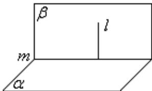

知识点诠释：面面垂直的性质定理是作线面垂直的依据和方法，在解决二面角问题中作二面角的平面角经常

用到．这种线面垂直与面面垂直间的相互转化，是我们立体几何中求解（证）问题的重要思想方法．

2、平面与平面垂直性质定理的推论

如果两个平面互相垂直，那么经过第一个平面内的一点垂直于第二个平面的直线，在第一个平面内。

【即学即练】

1. 如图， $AC$ 是圆 $O$ 的直径， $PA$ 与圆 $O$ 所在的平面垂直，且 $PA = AC = 2$ ， $B$ 为圆周上不与点 $A, C$ 重合的动

点， $M,N$ 分别为点 $A$ 在线段 $PC,PB$ 的投影

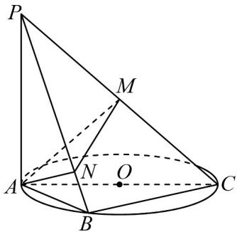

(1)证明：直线 $AN \perp$ 平面 $PBC$ ；

(2)求三棱锥 P-ABC 外接球的体积；

(3)当 $\triangle AMN$ 的面积最大时，求二面角 $A - PC - B$ 的平面角的大小.

【答案】(1)证明见解析 (2) $\frac{8\sqrt{2}\pi}{3}$ (3) $\frac{\pi}{4}$

【分析】（1）先证明 $BC \perp$ 平面 PAB 从而得到 $BC \perp AN$ ，再根据 $AN \perp PB$ 从而证明 $AN \perp$ 平面 PBC；

(2) 先证明点 M 为外接球的球心，求出半径即可求出答案；

(3) 证明 $AN \perp PC$ ， $PC \perp MN$ ，从而得到 $\angle AMN$ 即为二面角 $A - PC - B$ 的平面角，接着证明 $\triangle AMN$ 为直角

三角形，利用基本不等式得到 $\triangle AMN$ 的面积最大时 $NA = NM$ ，即可得到答案

【详解】（1）因为点 B 在圆 O 的圆周上，AC 为圆 O 的直径，所以 $AB \perp BC$ ，

又 $PA \perp$ 平面 ABC ， $BC \subset$ 平面 ABC ，所以 $PA \perp BC$

又 $AB, PA \subset$ 平面 $PAB$ ， $AB \cap PA = A$ ，所以 $BC \perp$ 平面 $PAB$ ，

因为 $AN \subset$ 平面 PAB ，所以 $BC \perp AN$ ，又 N 为 A 在 PB 上的投影，所以 $AN \perp PB$

$PB, BC \subset \text{平面} PBC, PB \cap BC = B$ ，所以 $AN \perp \text{平面} PBC$ .

(2) 因为 $PA \perp$ 平面 ABC， $AC \subset$ 平面 ABC，所以 $PA \perp AC$ ，

因为 $BC \perp$ 平面 PAB ， $PB \subset$ 平面 PAB ，所以 $BC \perp PB$

因为 $M$ 为 $PC$ 的中点，所以 $MA = MB = MP = MC = \frac{1}{2} PC = \frac{1}{2}\sqrt{PA^2 + AC^2} = \frac{1}{2}\sqrt{2^2 + 2^2} = \sqrt{2}$

所以三棱锥 $P - ABC$ 外接球的半径为 $\sqrt{2}$ ，外接球的体积为 $\frac{4}{3}\pi (\sqrt{2})^3 = \frac{8\sqrt{2}}{3}\pi$ 。

(3) 因为 $AN \perp$ 平面 PBC， $PC \subset$ 平面 PBC，所以 $AN \perp PC$ ，

又 M 为 A 在 PC 上的投影，所以 $AM \perp PC$ ， $AM, AN \subset$ 平面 AMN， $AM \cap AN = A$ ，所以 $PC \perp$ 平面 AMN，

又 $MN \subset$ 平面 $AMN$ ，所以 $PC \perp MN$ ，所以 $\angle AMN$ 即为二面角 $A - PC - B$ 的平面角，

又 $AN \perp$ 平面 $PBC$ ， $MN \subset$ 平面 $PBC$ ，所以 $AN \perp MN$ ，即 $\triangle AMN$ 为直角三角形，

且斜边 $AM = \frac{1}{2}PC = \sqrt{2}$ 为定值，

所以 $2 = NA^{2} + NM^{2}$ 2NA□NM，所以 $NA\square NM \leq 1$ ，当 $NA = NM = 1$ 时等号成立，

所以 $S_{\triangle AMN} = \frac{1}{2} NA \square NM \leq \frac{1}{2}$ ，当 $NA = NM = 1$ 时等号成立，

此时 $\triangle AMN$ 为等腰直角三角形，所以 $\angle AMN = \frac{\pi}{4}$

所以当 $\triangle A M N$ 的面积最大时，求二面角 $A - P C - B$ 的平面角的大小为 $\overline{4}$

2．如图，在三棱锥 A-BCD 中，CB=CD，点 E 为 BD 中点， $AB=\sqrt{2}$ ，平面 $ABD\perp$ 平面 BCD，点 O 在 BD

上，且 BO = 1，OD = 3，AO = 1，点 P 在 AD 上，且满足 AO // 平面 PCE.

(1)求证： $AO \perp$ 平面 BCD；

(2)求 $\frac{AP}{AD}$ 的值；

(3)若二面角 A-BC-D 的大小为 $\frac{\pi}{3}$ ，求四面体 P-ABC 的体积.
【答案】 $^{(1)}$ 证明见解析
(2) $\frac{1}{3}$ (3) $\frac{2\sqrt{2}}{9}$

【分析】（ $^{1}$ ）先根据勾股定理得出 $AO \perp BD$ ，进而应用平面 $ABD \perp$ 平面 BCD 的性质定理证明线面垂直；
（ $^{2}$ ）先根据线面平行性质定理得出 $AO // PE$ ，结合边长关系得出比例关系；
（ $^{3}$ ）根据二面角定义得出 $\angle AFO$ 即为二面角 A-BC-D 的平面角，再结合边长关系得出 $CE = \sqrt{2}$ ，最后应用
三棱锥体积公式计算求解·

【详解】（1）在三角形 $ABO$ 中， $AB = \sqrt{2}$ ， $BO = 1$ ， $AO = 1$ ，因此 $AB^2 = BO^2 + AO^2$ ，可得 $AO \perp BD$ . 由于平面 $ABD \perp$ 平面 $BCD$ ， $AO$ 在平面 $ABD$ 内，平面 $ABD \cap$ 平面 $BCD = BD$ ，因此 $AO \perp$ 平面 $BCD$ ；(2)

连接 $PE$ ， $AO / /$ 平面 $PCE$ ， $AO \subset$ 平面 $ABD$ ，平面 $ABD \cap$ 平面 $PCE = PE$

因此 $AO // PE$ . 因为 $BO = 1$ ， $OD = 3$ ，因此 $OE = 1$ ， $ED = 2$ ，因此 $\frac{AP}{AD} = \frac{OE}{OD} = \frac{1}{3}$ ；

(3) 设四面体 P-ABC 的体积为 V，

由（2）得 $\frac{AP}{AD} = \frac{1}{3}$ ，则 $V = \frac{1}{3} V_{D - ABC} = \frac{1}{3} V_{A - BCD}$

由于平面 $ABD \perp$ 平面 $BCD$ ，平面 $ABD \cap$ 平面 $BCD = BD$ ， $CE \perp BD$ ， $CE \subset$ 平面 $BCD$ ，

因此 $CE \perp$ 平面ABD，

又 $AO \perp$ 平面 $BCD$ , $BC \subset$ 平面 $BCD$ , 则 $AO \perp BC$ ,

过 O 作 $OF \perp BC$ 于点 F，

，FO，平面AFO，则平面AFO， $FO \cap AO = O$ $AO \subset BC \perp$

又 $AF \subset$ 平面 $AFO$ ，因此 $AF \perp BC$ ，因此 $\angle AFO$ 即为二面角 $A - BC - D$ 的平面角，

因为 $\angle AFO = \frac{\pi}{3}$ ， $FO\bot AO$ ， $AO = 1$ ，则 $OF = \frac{\sqrt{3}}{3}$

又 BO = 1，在 Rt△BFO 中由勾股定理得 $BF = \frac{\sqrt{6}}{3}$ ，又 BE = 2，

由 $\frac{BF}{BE} = \frac{OF}{CE}$ ，得 $CE = \sqrt{2}$ ，因此 $V = \frac{1}{3} V_{A-BCD} = \frac{1}{3} \times \frac{1}{3} \times \frac{1}{2} \times AO \times BD \times CE = \frac{1}{3} \times \frac{1}{3} \times \frac{4 \times 1}{2} \times \sqrt{2} = \frac{2\sqrt{2}}{9}$ .

## 题型精讲

![[高中/课堂同步/题库/人教A版高中数学同步讲义(2026)/02_必修第二册/第八章 立体几何初步/专题8.6 空间直线、平面的垂直（高效培优讲义）/题型01_证明两直线垂直/题型01_证明两直线垂直.md]]
![[高中/课堂同步/题库/人教A版高中数学同步讲义(2026)/02_必修第二册/第八章 立体几何初步/专题8.6 空间直线、平面的垂直（高效培优讲义）/题型02_求异面直线所成的角/题型02_求异面直线所成的角.md]]
![[高中/课堂同步/题库/人教A版高中数学同步讲义(2026)/02_必修第二册/第八章 立体几何初步/专题8.6 空间直线、平面的垂直（高效培优讲义）/题型03_直线与平面垂直的判定/题型03_直线与平面垂直的判定.md]]
![[高中/课堂同步/题库/人教A版高中数学同步讲义(2026)/02_必修第二册/第八章 立体几何初步/专题8.6 空间直线、平面的垂直（高效培优讲义）/题型04_直线与平面所成角/题型04_直线与平面所成角.md]]
![[高中/课堂同步/题库/人教A版高中数学同步讲义(2026)/02_必修第二册/第八章 立体几何初步/专题8.6 空间直线、平面的垂直（高效培优讲义）/题型05_空间中的距离问题/题型05_空间中的距离问题.md]]
![[高中/课堂同步/题库/人教A版高中数学同步讲义(2026)/02_必修第二册/第八章 立体几何初步/专题8.6 空间直线、平面的垂直（高效培优讲义）/题型06_面面垂直判定定理的应用/题型06_面面垂直判定定理的应用.md]]
![[高中/课堂同步/题库/人教A版高中数学同步讲义(2026)/02_必修第二册/第八章 立体几何初步/专题8.6 空间直线、平面的垂直（高效培优讲义）/题型07_求二面角/题型07_求二面角.md]]
![[高中/课堂同步/题库/人教A版高中数学同步讲义(2026)/02_必修第二册/第八章 立体几何初步/专题8.6 空间直线、平面的垂直（高效培优讲义）/强化训练/强化训练.md]]
