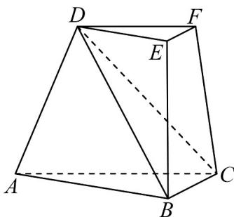

<!-- question-source:start -->
6. 如图，在三棱台 $ABC - DEF$ 中，平面 $ACFD \perp$ 平面 $ABC$ ， $\angle ACB = \angle ACD = 45^{\circ}$ ， $DC = 2BC = 2\sqrt{2}$

(1)证明 $EF\perp BD$

(2)求直线 $DF$ 与平面 $DBC$ 夹角的正弦值.
<!-- question-source:end -->

![[高中/课堂同步/题库/人教A版高中数学同步讲义(2026)/02_必修第二册/第八章 立体几何初步/专题8.6 空间直线、平面的垂直（高效培优讲义）/强化训练/questions/answers/Q00069891A1.md]]
