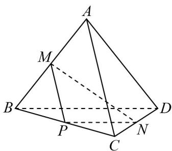

> [!faq]- 《专题8.6 空间直线、平面的垂直（高效培优讲义）》官方解析
>
> > [!success]- **【答案】** CD
>
> > [!note]- **【分析】**
> > 利用异面直线所成角的定义和余弦定理求解可得·
>
> > [!note]- **【解析】**
> > 取 $BC$ 的中点为 $P$ ，连接 $PM$ ， $PN$ ，如图：
> >
> > 
> >
> > 在VABC中， $PM \parallel AC$ ，且 $PM = \frac{1}{2} AC = \frac{3}{2}$ ，在 $\triangle BCD$ 中，PN//BD，且 $PN = \frac{1}{2} BD = 1$ ，
> > 因为异面直线AC与BD所成角的大小为 $60^{\circ}$ ，所以直线PM，PN的夹角为 $60^{\circ}$ ，则 $\angle MON = 60^{\circ}$ 或 $120^{\circ}$ ，
> > 当 $\angle MPN=60^{\circ}$ 时，由余弦定理得， $MN^{2}=PM^{2}+PN^{2}-2PM\cdot PN\times\cos60^{\circ}=\frac{9}{4}+1-\frac{3}{2}=\frac{7}{4}$ ，得 $MN=\frac{\sqrt{7}}{2}$ ·
> > 当 $\angle MPN=120^{\circ}$ 时，由余弦定理得， $MN^{2}=PM^{2}+PN^{2}-2PM\cdot PN\times\cos120^{\circ}=\frac{9}{4}+1+\frac{3}{2}=\frac{19}{4}$ ，得 $MN=\frac{\sqrt{19}}{2}$ ·
> > 综上所述， $MN=\frac{\sqrt{7}}{2}$ 或 $MN=\frac{\sqrt{19}}{2}$ ·
> >
> > 故选 **CD**
