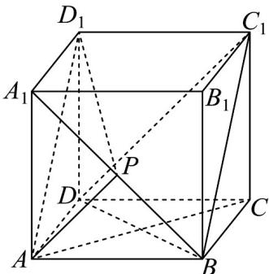
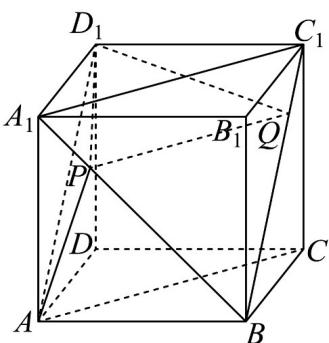
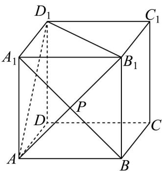

> [!faq]- 《专题8.6 空间直线、平面的垂直（高效培优讲义）》官方解析
>
> > [!success]- **【答案】** A. 存在点 $P$ ，使得平面 $PD_{1}A_{1} \perp$ 平面 $PAA_{1}$ B. 不存在点 $P$ ，使得平面 $APD_{1} //$ 平面 $BDC_{1}$ C. 存在点 $P$ ，使得直线 $PD_{1}$ 与 $AC$ 所成角为 $\frac{\pi}{3}$ D. 平面 $APD_{1}$ 截正方体所得的截面可能是等腰三角形
>
> > [!note]- **【分析】**
> > 对 $^{A}$ ，利用面面垂直的判定定理即可判断；对 $^{B}$ ，当点P为 $A_{1}B$ 的中点时，证明面面平行，即可判断：
> >
> > 对 $C$ ，当点 $P$ 为线段 $A_{1}B$ 上靠近 $A_{1}$ 的四等分点时，利用线线角的定义求解判断；对 $D$ ，当点 $P$ 为线段 $A_{1}B$ 的中
> >
> > 点时，此时平面 $APD_{1}$ 截正方体所得的截面为正三角形 $AB_{1}D_{1}$
>
> > [!note]- **【解析】**
> > 对于 A，因为在正方体 $ABCD - A_{1}B_{1}C_{1}D_{1}$ 中， $A_{1}D_{1} \perp$ 平面 $AA_{1}B_{1}B$
> >
> > 又平面 $PAA_{1}$ 与平面 $AA_{1}B_{1}B$ 是同一个平面， $A_{1}D_{1} \subset$ 平面 $PD_{1}A_{1}$
> >
> > 所以无论点 P 在线段 $A_{1}B$ （不含端点）上任何位置都有平面 $PD_{1}A_{1} \perp$ 平面 $PAA_{1}$ ，故 A 正确；
> >
> > 对于 $^{B}$ ，当点P为 $A_{1}B$ 的中点时，有 $AP//DC_{1}$ ， $AP\notin$ 平面 $BDC_{1}$ ， $DC_{1}\subset$ 平面 $BDC_{1}$ ，所以AP//平面 $BDC_{1}$ ，
> > 同理， $AD_{1} //$ 平面 $BDC_{1}$ ，且 $AD_{1} \cap AP = A$ ， $AD_{1}, AP \subset$ 平面 $APD_{1}$ ，所以平面 $APD_{1} //$ 平面 $BDC_{1}$ ，故 $^{B}$ 错误；
> >
> > 
> >
> > 对于 $C$ ，当点 $P$ 为线段 $A_{1}B$ 上靠近 $A_{1}$ 的四等分点时，如图，连接 $BC_{1}, A_{1}C_{1}$
> >
> > 过点 $P$ 作 $PQ \parallel A_{1}C_{1}$ ，交 $BC_{1}$ 于 $Q$ ，则 $PQ = \frac{3}{4} A_{1}C_{1} = \frac{3\sqrt{2}}{4}$
> >
> > 又正方体 $ABCD - A_{1}B_{1}C_{1}D_{1}$ 中， $AC // A_{1}C_{1}$ ，所以 $PQ // AC$ ，则直线 $PD_{1}$ 与 $AC$ 所成角为 $\angle D_{1}PQ$
> >
> > 又 $D_{1}P = \sqrt{D_{1}A_{1}^{2} + A_{1}P^{2}} = \sqrt{1 + \left(\frac{\sqrt{2}}{4}\right)^{2}} = \frac{3\sqrt{2}}{4}, D_{1}Q = \sqrt{D_{1}C_{1}^{2} + C_{1}Q^{2}} = \sqrt{1 + \left(\frac{\sqrt{2}}{4}\right)^{2}} = \frac{3\sqrt{2}}{4}$
> >
> > 所以 $\triangle D_{1}PQ$ 为等边三角形，所以 $\angle D_{1}PQ = \frac{\pi}{3}$ ，故 C 正确；
> >
> > 
> >
> > 对于 $^{D}$ ，如图，当点P为线段 $A_{1}B$ 的中点时，此时平面 $APD_{1}$ 截正方体所得的截面为正三角形 $AB_{1}D_{1}$ ，故 $^{D}$ 正
> >
> > 确·
> >
> > 
> >
> > 故选 **ACD**.
