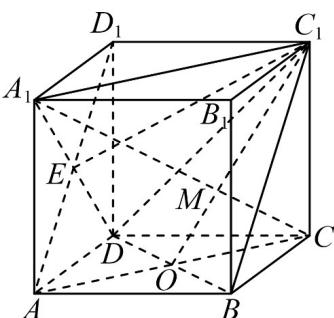

> [!faq]- 《专题8.6 空间直线、平面的垂直（高效培优讲义）》官方解析
>
> > [!success]- **【答案】** ABC
>
> > [!note]- **【分析】**
> > 利用正方体的结构特征，结合平面基本事实、线面垂直的判定推理判断 $^{AB}$ ；利用线面角及面面角的
> >
> > 几何法求解判断 CD.
>
> > [!note]- **【解析】**
> > 在正方体 $ABCD - A_{1}B_{1}C_{1}D_{1}$ 中，连接 $AC, C_{1}O$ ，由 O 为 DB 的中点，得 O 是 AC 的中点，
> >
> > 对于 $\mathsf{A}$ ， $AA_{1} / / CC_{1}$ ， $A_{1}C\subset$ 平面 $ACC_{1}A_{1}$ ，而 $M\in A_1C$ ，则 $M\in$ 平面 $ACC_{1}A_{1}$
> >
> > 而 $O, C_{1} \in$ 平面 $ACC_{1}A_{1}$ ， $O, M, C_{1} \in$ 平面 $C_{1}BD$ ，且平面 $C_{1}BD \cap$ 平面 $ACC_{1}A_{1} = C_{1}O$
> >
> > 所以 $C_{1}, M, O \in C_{1}O$ ，即 $C_{1}, M, O$ 三点共线，A 正确；
> >
> > 对于 $^{B}$ ，由 $AA_{1} \perp$ 平面 ABCD， $BD \subset$ 平面 ABCD，得 $AA_{1} \perp BD$
> >
> > 又 $AC \perp BD$ ， $AA_{1} \cap AC = A, AA_{1}, AC \subset$ 平面 $ACC_{1}A_{1}$ ，则 $BD \perp$ 平面 $ACC_{1}A_{1}$
> >
> > 又 $A_{1}C \subset$ 平面 $ACC_{1}A_{1}$ ，所以 $BD \perp A_{1}C$ ，同理 $BC_{1} \wedge A_{1}C$
> >
> > 而 $BD \cap BC_{1} = B, BD, BC_{1} \subset$ 平面 $C_{1}BD$ ，因此 $A_{1}C \perp$ 平面 $C_{1}BD$ ，B正确；
> >
> > 
> >
> > 对于 C，连接 $AD_{1}, A_{1}D$ ，令交点为 E，连接 $C_{1}E$ ，由选项 B，同理 $A_{1}D \perp$ 平面 $ABC_{1}D_{1}$
> >
> > 则 $\angle A_{1}C_{1}E$ 是直线 $A_{1}C_{1}$ 与平面 $ABC_{1}D_{1}$ 所成的角，
> >
> > 所以 $\sin \angle A_{1}C_{1}E = \frac{A_{1}E}{A_{1}C_{1}} = \frac{\frac{1}{2}A_{1}C_{1}}{A_{1}C_{1}} = \frac{1}{2}$ ，所以 $\angle A_1C_1E = \frac{\pi}{6}$
> >
> > 因此直线 $A_{1}C_{1}$ 与平面 $ABC_{1}D_{1}$ 所成角为 $\frac{\pi}{6}$ ，C 正确；
> >
> > 对于 D，由选项 B 得 $C_{1}O \perp BD, CO \perp BD$ ，则 $\angle C_{1}OC$ 是平面 ABCD 和平面 $C_{1}BD$ 夹角，
> >
> > 而 $CC_{1} \perp$ 平面ABCD，则 $\tan\angle C_{1}OC=\frac{CC_{1}}{CO}=\sqrt{2}>\frac{\sqrt{3}}{3}$ ， $\angle C_{1}OC>\frac{\pi}{6}$ ，D错误·
> >
> > 故选 **ABC**
