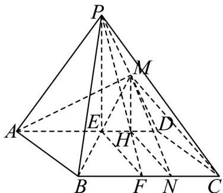

> [!faq]- 《专题8.6 空间直线、平面的垂直（高效培优讲义）》官方解析
>
> > [!success]- **【答案】** (1)证明见解析 (2) $\frac{\pi}{4}$
>
> > [!note]- **【分析】**
> > （1）由已知侧面 $PAD \perp$ 底面ABCD，得 $CD \perp$ 平面PAD，则 $CD \perp AM$ ，又侧面PAD是正三角形，
> >
> > 可得 $PD \perp AM$ ，即可得证；
> >
> > (2) 由已知，作出二面角 P-BC-D 的平面角 $\angle PFE$ ，证出 $\triangle PEF$ 是直角三角形，则可求出二面角的大小.
>
> > [!note]- **【解析】**
> > （1）在四棱锥 P-ABCD 中，由底面 ABCD 为矩形，得 $CD \perp AD$ ，
> >
> > 由侧面 $PAD \perp$ 底面 ABCD ，侧面 $PAD \cap$ 底面 ABCD = AD
> >
> > $CD \subset$ 平面 ABCD ，得 $CD \perp$ 平面 PAD ，
> >
> > 又 $AM \subset$ 平面 PAD ，则 $CD \perp AM$
> >
> > 又侧面 PAD 是正三角形，M 是 PD 的中点，则 $PD \perp AM$ ，
> >
> > 又 $PD \cap CD = D$ ， $PD$ ， $CD \subset$ 平面 $PCD$
> >
> > 所以 $AM \perp$ 平面 $PCD$
> >
> > 
> >
> > (2) 如图，取 AD，BC 中点 E、F，连接 PE、PF、EF，
> >
> > 因为底面 ABCD 为矩形，侧面 PAD 是正三角形，
> >
> > 所以 $AD \perp PE$ ， $AD \perp EF$ ，且 $PE \cap EF = E$ 且都在平面 PEF 内，
> >
> > 所以 $AD \perp$ 平面 PEF ，又 BC // AD ，
> >
> > 所以 $BC \perp$ 平面 PEF ， PE ， $FP \subset$ 平面 PEF ，
> >
> > 所以 $BC \perp FE$ ， $BC \perp FP$ ，
> >
> > 所以 $\angle PFE$ 就是二面角 $P - BC - D$ 的平面角，
> >
> > 由（1）知 $CD \perp$ 平面 $PAD$ ，因为 $EF // CD$ ，所以 $EF \perp$ 平面 $PAD$ ，
> >
> > $PE \subset$ $PAD$ ，则 $EF \perp PE$
> >
> > 在直角三角形 PEF 中， $EF = AB = \sqrt{3}$ ，
> >
> > 又正三角形 PAD 中 AD = 2 ，则 $PE = \sqrt{3}$
> >
> > <!-- source-part:3 pages:101-108 -->
> >
> > 所以 $\tan\angle PFE=\frac{PE}{EF}=1$ ，所以 $\angle PFE=\frac{\pi}{4}$
> >
> > 即二面角 $P - BC - D$ 为 $\frac{\pi}{4}$
