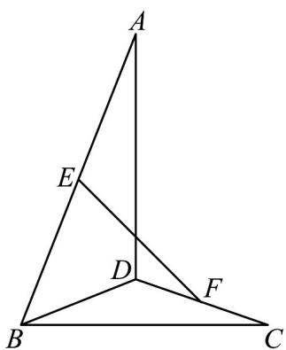

<!-- question-source:start -->
【变式2】如图所示，在空间四边形ABCD中， $AD = BC = 2$ ， $E$ ， $F$ 分别是 $AB$ ， $CD$ 的中点， $EF = \sqrt{2}$ .求证：

$AD\bot BC$

<!-- question-source:end -->

![[高中/课堂同步/题库/人教A版高中数学同步讲义(2026)/02_必修第二册/第八章 立体几何初步/专题8.6 空间直线、平面的垂直（高效培优讲义）/题型01_证明两直线垂直/questions/answers/Q00069866A1.md]]
