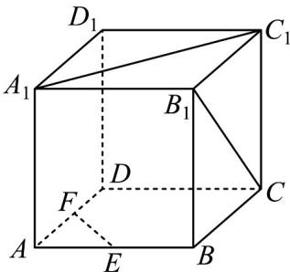

<!-- question-source:start -->
【变式3】如图，已知正方体 $ABCD - A_{1}B_{1}C_{1}D_{1}$ .

(1) 求 $A_{1}C_{1}$ 与 $B_{1}C$ 所成角的大小；

(2) 若 $E, F$ 分别为棱 $AB, AD$ 的中点，求证： $A_{1}C_{1} \perp EF$ .
<!-- question-source:end -->

![[高中/课堂同步/题库/人教A版高中数学同步讲义(2026)/02_必修第二册/第八章 立体几何初步/专题8.6 空间直线、平面的垂直（高效培优讲义）/题型01_证明两直线垂直/questions/answers/Q00069867A1.md]]
