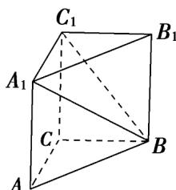

> [!faq]- 《专题8.6 空间直线、平面的垂直（高效培优讲义）》官方解析
>
> > [!success]- **【答案】** 证明见解析
>
> > [!note]- **【分析】**
> > 找到异面直线的夹角，利用直三棱柱的性质求出夹角度数，再证明线线垂直即可·
>
> > [!note]- **【解析】**
> > 如图，连接 $A_{1}B$ ，设 $A_{1}C_{1}=a$ ， $B_{1}C_{1}=b$ ， $AA_{1}=h$ ，
> >
> > 由直三棱柱性质得 $A_{1}C_{1} = AC = a$ ， $B_{1}C_{1} = BC = b$ ，因为 $AC\perp BC$ ，所以由勾股定理得 $AB^{2} = a^{2} + b^{2}$
> >
> > 
> >
> > 因为三棱柱 $ABC-A_{1}B_{1}C_{1}$ 是直三棱柱，所以 $\angle BB_{1}C_{1}=\angle A_{1}AB=90^{\circ}$
> >
> > 由勾股定理得 $A_{1}B^{2}=AA_{1}^{2}+AB^{2}=a^{2}+b^{2}+h^{2}$ ， $BC_{1}^{2}=b^{2}+h^{2}$
> >
> > 故 $A_{1}B^{2} = A_{1}C_{1}^{2} + BC_{1}^{2}$ ，则 $A_{1}C_{1}\perp BC_{1}$ ，即 $\angle A_1C_1B = 90^\circ$
> >
> > 由直三棱柱性质得 $AC / / A_{1}C_{1}$ ，故 $\angle A_{1}C_{1}B$ 就是直线 $AC$ 与 $BC_{1}$ 所成的角，所以 $AC\perp BC_{1}$ 得证.
