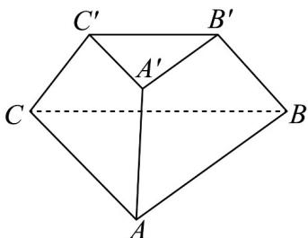

<!-- question-source:start -->
【变式1】如图，三棱台 $ABC - A'B'C'$ 的侧棱长均相等，VABC和 $\triangle A'B'C'$ 都是等边三角形，

$A^{\prime}B^{\prime}=2,AB=4,AA^{\prime}=\sqrt{2}$ ，则（）

A. 直线 $AA'$ 与直线 $CC'$ 所成的角为 $\frac{\pi}{3}$

B. 直线 $AB$ 与直线 $A^{\prime}C^{\prime}$ 所成的角为 $\frac{\pi}{3}$

C. 三棱台 $ABC - A'B'C'$ 的体积为 $2\sqrt{2}$

D．三棱台 $ABC-A'B'C'$ 的体积为 $\frac{7\sqrt{2}}{3}$
<!-- question-source:end -->

![[高中/课堂同步/题库/人教A版高中数学同步讲义(2026)/02_必修第二册/第八章 立体几何初步/专题8.6 空间直线、平面的垂直（高效培优讲义）/题型02_求异面直线所成的角/questions/answers/Q00069868A1.md]]
