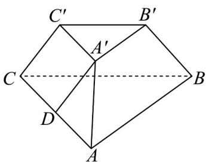
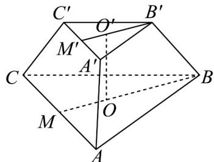

> [!faq]- 《专题8.6 空间直线、平面的垂直（高效培优讲义）》官方解析
>
> > [!success]- **【答案】** BD
>
> > [!note]- **【分析】**
> > 对于 A，先判断三棱台 $ABC - A'B'C'$ 为正三棱台，过点 $A'$ 作 $A'D//CC'$ ，交 AC 于点 D，证明 $\angle DA'A$
> >
> > 即直线 $AA'$ 与直线 $CC'$ 所成的角，求得 $\angle DA'A = 90^\circ$ 即可判断；对于 $^{B}$ ，平移后易得结论成立；对于 $^{C}$ ， $^{D}$ ，先
> >
> > 求出三棱台的高的长，再利用棱台体积公式计算即可判断·
>
> > [!note]- **【解析】**
> > 
> >
> > 对于 $A$ ，因侧棱相等且底面为等边三角形，则三棱台 $ABC - A'B'C'$ 为正三棱台，
> >
> > 如图，过点 $A'$ 作 $A'D//CC'$ ，交 $AC$ 于点 $D$ ，因 $A'C'//AC$ ，则得 $\square CC'A'D$ ，则 $CC'//A'D$
> >
> > $A^{\prime}D = CC^{\prime} = \sqrt{2}$ ，故 $\angle DA^{\prime}A$ 即直线 $AA^{\prime}$ 与直线 $CC^{\prime}$ 所成的角，因 $AD = AC - A^{\prime}C^{\prime} = 2$
> >
> > 由 $A^{\prime}D^{2} + A^{\prime}A^{2} = AD^{2}$ 可得 $\angle DA'A = 90^{\circ}$ ，故A错误；
> >
> > 对于 $^{B}$ ，因 $AB//A'B'$ ，且 $A'C'$ 与 $A'B'$ 的夹角为 $60^{\circ}$ ，故 AB 与 $A'C'$ 的夹角为 $60^{\circ}$ ，故 B 正确；
> >
> > 对于 $C, D$ ，如图，分别取上下底面三角形的中心为 $O', O$ ，连接 $BO$ 并延长交 $AC$ 于点 $M$
> >
> > 连接 $B^{\prime}O^{\prime}$ 并延长交 $A^{\prime}C^{\prime}$ 于点 $M^{\prime}$ ，则 $OO^{\prime}$ 即三棱台的高，
> >
> > 则 $BM = \frac{\sqrt{3}}{2} \times 4 = 2\sqrt{3}, B'M' = \frac{\sqrt{3}}{2} \times 2 = \sqrt{3}, B'O' = \frac{2}{3} B'M' = \frac{2\sqrt{3}}{3}, BO = \frac{2}{3} BM = \frac{4\sqrt{3}}{3}$
> >
> > 在直角梯形 $OO \notin B \notin B$ 中， $OO' = \sqrt{(\sqrt{2})^2 - (\frac{4\sqrt{3}}{3} - \frac{2\sqrt{3}}{3})^2} = \frac{\sqrt{6}}{3}$ ，
> >
> > 因 $S_{\triangle ABC} = \frac{\sqrt{3}}{4}\times 4^2 = 4\sqrt{3},S_{\triangle A'B'C'} = \frac{\sqrt{3}}{4}\times 2^2 = \sqrt{3}$
> >
> > 则三棱台 $ABC - A'B'C'$ 的体积为 $V = \frac{1}{3} \times \frac{\sqrt{6}}{3} \times (4\sqrt{3} + \sqrt{4\sqrt{3} \times \sqrt{3}} + \sqrt{3}) = \frac{7}{3}\sqrt{2}$ ，故 D 正确.
> >
> > 故选：BD.
> >
> > 
