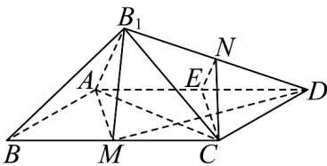

> [!faq]- 《专题8.6 空间直线、平面的垂直（高效培优讲义）》官方解析
>
> > [!success]- **【答案】** $60^{\circ}$
>
> > [!note]- **【分析】**
> > 取 $AD$ 的中点 $E$ ，连接 $EN, EC$ ， $\angle ENC$ （或其补角）就是 $AB_{1}$ 与 $CN$ 所成的角，进而计算求解即可·
>
> > [!note]- **【解析】**
> > 取 $AD$ 的中点 $E$ ，连接 $EN,EC$
> >
> > 
> >
> > 则 $AB_{1} // NE$ ，则 $\angle ENC$ （或其补角）就是 $AB_{1}$ 与 $CN$ 所成的角，
> >
> > 因为 M 为 BC 的中点，所以 AE = MC ， AE // MC
> >
> > 所以四边形MCEA为平行四边形，所以 $EC / / AM$ ， $EC = AM$ ，所以 $\angle B_{1}AM = \angle NEC$
> >
> > 因为菱形 $ABCD$ 中， $\angle ABC = 60^{\circ}$ ，所以 $\mathrm{V}ABC$ 是等边三角形，所以 $AM \perp BC$
> >
> > 所以 $\angle BAM = 30^{\circ}$ ，即 $\angle B_{1}AM = 30^{\circ}$ ，所以 $\angle NEC = 30^{\circ}$
> >
> > 又 $AB = 2$ ，所以 $AM = \frac{\sqrt{3}}{2} AB = \sqrt{3}$ ， $B_{1}M = BM = 1$ ， $NE = \frac{1}{2} B_{1}A = \frac{1}{2} BA = 1$
> >
> > 所以 $NC = \sqrt{NE^2 + EC^2 - 2NE\cdot EC\cos 30^\circ} = \sqrt{1^2 + (\sqrt{3})^2 - 2\times 1\times\sqrt{3}\times\frac{\sqrt{3}}{2}} = 1$
> >
> > 所以 $NE = NC$ ，所以 $\angle NCE = \angle NEC = 30^{\circ}$
> >
> > 所以 $\angle ENC = 180^{\circ} - 30^{\circ} - 30^{\circ} = 120^{\circ}$ ，所以 $AB_{1}$ 与 CN 的夹角为 $60^{\circ}$
> >
> > 故答案为： $60^{\circ}$
