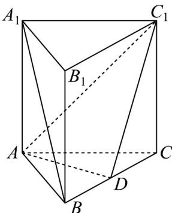
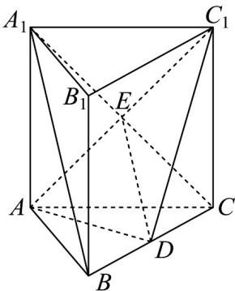
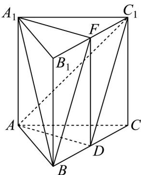

## 题型02 求异面直线所成的角

【典例1】如图，在正三棱柱 $ABC - A_{1}B_{1}C_{1}$ 中， $AB = AA_{1}$ ， $D$ 为棱 $BC$ 的中点.

(1)证明： $A_{1}B//$ 平面 $ADC_{1}$ ；

(2)求异面直线 $A_{1}B$ 与 AD 所成角的余弦值.

【答案】(1)证明见解析

(2) $\frac{\sqrt{6}}{4}$

【分析】（ $^{1}$ ）根据线面平行的判定定理即可证明结论；

(2) 作出异面直线 $A_{1}B$ 与 $AD$ 所成角 $\angle BA_{1}F$ ，判断 $\triangle A_{1}BF$ 是直角三角形，即可求得答案.

【详解】（1）连接 $A_{1}C$ 交 $AC_{1}$ 于 $E$ ，连接 $ED$ ，易得 $E$ 为 $A_{1}C$ 中点.

在正三棱柱 $ABC-A_{1}B_{1}C_{1}$ 中，因为 D、E 分别为 BC、 $A_{1}C$ 中点，所以 $A_{1}B // DE$

又因为 $DE \subset$ 平面 $ADC_{1}$ ， $A_{1}B \notin$ 平面 $ADC_{1}$ ，所以 $A_{1}B //$ 平面 $ADC_{1}$

(2) 取 $B_{1}C_{1}$ 中点 $F$ ，连接 $A_{1}F, BF, DF$

在正三棱柱 $ABC-A_{1}B_{1}C_{1}$ 中，设 $AB=AA_{1}=2a$ ，因为 D、F 分别为 BC、 $B_{1}C_{1}$ 中点，

可得 $DF //BB_{1} //AA_{1}$ ，且 $DF = BB_{1} = AA_{1}$ ，所以四边形 $ADFA_{1}$ 是平行四边形

所以 $AD \parallel A_{1}F$ ， $\angle BA_{1}F$ 或其补角即为异面直线 $A_{1}B$ 与 AD 所成的角。

在 $\triangle A_{1}BF$ 中， $A_{1}B = 2\sqrt{2} a, BF = \sqrt{5} a, A_{1}F = \sqrt{3} a$

满足 $A_{1}B^{2}=BF^{2}+A_{1}F^{2}$ ，则 $\triangle A_{1}BF$ 是直角三角形，

所以 $\cos \angle BA_{1}F = \frac{A_{1}F}{A_{1}B} = \frac{\sqrt{3}a}{2\sqrt{2}a} = \frac{\sqrt{6}}{4}$ .即异面直线 $A_{1}B$ 与 $AD$ 所成角的余弦值为 $\frac{\sqrt{6}}{4}$

## 方法技巧

求异面直线所成角的一般步骤：

（1）找（或作出）异面直线所成的角——用平移法，若题设中有中点，常考虑中位线.

(2) 求——转化为求一个三角形的内角，通过解三角形，求出所找的角.

（3）结论——设（2）所求角大小为 $\theta$ 。若 $0^{\circ} < \theta \leq 90^{\circ}$ ，则 $\theta$ 即为所求；若 $90^{\circ} < \theta < 180^{\circ}$ ，则 $180^{\circ} - \theta$ 即为

所求

![[高中/课堂同步/题库/人教A版高中数学同步讲义(2026)/02_必修第二册/第八章 立体几何初步/专题8.6 空间直线、平面的垂直（高效培优讲义）/题型02_求异面直线所成的角/questions/Q00069868.md]]
![[高中/课堂同步/题库/人教A版高中数学同步讲义(2026)/02_必修第二册/第八章 立体几何初步/专题8.6 空间直线、平面的垂直（高效培优讲义）/题型02_求异面直线所成的角/questions/Q00069869.md]]
![[高中/课堂同步/题库/人教A版高中数学同步讲义(2026)/02_必修第二册/第八章 立体几何初步/专题8.6 空间直线、平面的垂直（高效培优讲义）/题型02_求异面直线所成的角/questions/Q00069870.md]]
