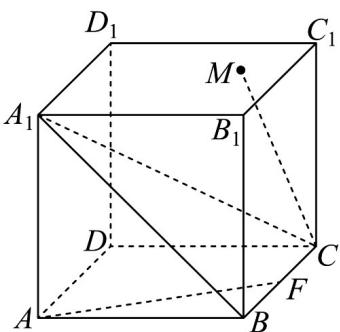

<!-- question-source:start -->
【变式3】如图，一块正方体木料，面 $A_{1}B_{1}C_{1}D_{1}$ 上有一点 $M$ ，

(1)经过点 $M$ 在面 $A_{1}B_{1}C_{1}D_{1}$ 上能否画一条直线，使其与 $CM$ 垂直，若可以，该怎么画，在答题纸上作图，写出

作图过程并加以证明；若不能，说明理由·

(2)若正方体棱长为 $^{2}$ ， $F$ 为线段 $BC$ 中点，求直线 $AF$ 与面 $A_{1}BC$ 所成角的正弦值·
<!-- question-source:end -->

![[高中/课堂同步/题库/人教A版高中数学同步讲义(2026)/02_必修第二册/第八章 立体几何初步/专题8.6 空间直线、平面的垂直（高效培优讲义）/题型03_直线与平面垂直的判定/questions/answers/Q00069873A1.md]]
