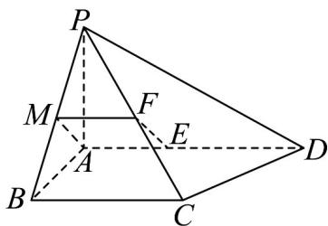

> [!faq]- 《专题8.6 空间直线、平面的垂直（高效培优讲义）》官方解析
>
> > [!success]- **【答案】** (1)证明见解析 (2)证明见解析 (3)证明见解析
>
> > [!note]- **【分析】**
> > （1）取 $PB$ 中点 $M$ ，连接 $MF$ 、 $AM$ ，根据几何性质，可得四边形 $AEFM$ 为平行四边形，进而可得
> >
> > EF // AM
> >
> > ，根据线面平行的判定定理，即可得证；
> >
> > (2) 根据线面垂直的性质、判定定理，可证 $BC \perp AM$ ，结合等腰三角形性质，可证 $AM \perp$ 平面 $PBC$ ，即可
> >
> > 得证；
> >
> > (3) 根据题干条件，可分别计算 $PE$ 、 $BE$ 、 $CE$ 、 $DE$ 的长度，结合条件，即可得证。
>
> > [!note]- **【解析】**
> > （1）证明：取 $PB$ 中点 $M$ ，连接 $MF$ 、 $AM$ ，
> >
> > $\because M、F$ 分别为 $PB、PC$ 的中点，
> >
> > $\therefore MF / / BC, MF = \frac{1}{2} BC = 1$
> >
> > ∵ $\overline{AD}=3\overline{AE}$ ，E 点在 AD 上， $AE=\frac{1}{3}AD=1$
> >
> > ∴ MF // AE 且 MF = AE
> >
> > 四边形 AEFM 为平行四边形，
> >
> > ∴ EF // AM
> >
> > ∵ EF ∉ 平面 PAB，AM ⊂ 平面 PAB，
> >
> > ∴ EF // 平面 PAB.
> >
> > 
> >
> > (2) 证明：∵ $AB \perp AD$ ， $BC \parallel AD$
> >
> > $\therefore AB \perp BC$
> >
> > ∵ $PA \perp_{平面} ABCD$
> >
> > $\therefore PA \perp BC$
> >
> > ∵ $AB \cap PA = A$ ， $AB \subset$ 平面 PAB， $PA \subset$ 平面 PAB，
> >
> > $\therefore BC \perp$ 平面 PAB，
> >
> > ∵ $AM \subset$ 平面 PAB，
> >
> > $\therefore BC \perp AM$
> >
> > $\because PA = AB$ , M 为 PB 的中点，
> >
> > $$
> > \therefore A M \perp P B
> > $$
> >
> > ∵ $BC \cap PB = B$ ， $BC \subset$ 平面 PBC， $PB \subset$ 平面 PBC，
> >
> > $\therefore AM \perp$ 平面 PBC，
> >
> > $\therefore EF \perp$ 平面 $PBC$ .
> >
> > (3) 证明：∵ PA⊥平面 ABCD，
> >
> > $\therefore PE = \sqrt{PA^{2} + AE^{2}} = 2$
> >
> > $$
> > \because A B \perp A D
> > $$
> >
> > $\therefore BE = \sqrt{AB^{2} + AE^{2}} = 2$
> >
> > $\because AE = 1, AB = \sqrt{3}, BE = 2$
> >
> > $\therefore \sin \angle ABE = \frac{1}{2}, \therefore \angle ABE = 30^{\circ}$
> >
> > $$
> > \therefore \angle E B C = 6 0 ^ {\circ}
> > $$
> >
> > $\because BE = BC = 2 \quad \therefore CE = 2$
> >
> > ∵ P、B、C、D $PE = BE = CE = DE = 2$ 在同一个球面上，且
> >
> > $\therefore E_{为球心}$
> >
> > 球心在平面 $ABCD$ 上·
