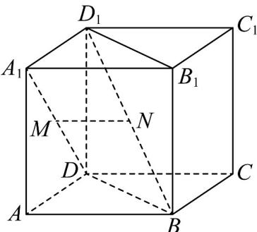
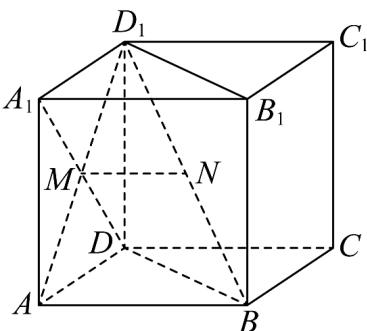

> [!faq]- 《专题8.6 空间直线、平面的垂直（高效培优讲义）》官方解析
>
> > [!success]- **【答案】**  A. 直线 $A_{1}D$ 与直线 $D_{1}B$ 垂直，直线 $MN \parallel$ 平面 $ABCD$ ； B. 直线 $A_{1}D$ 与直线 $D_{1}B$ 平行，直线 $MN \perp$ 平面 $BDD_{1}B_{1}$ ； C. 直线 $A_{1}D$ 与直线 $D_{1}B$ 相交，直线 $MN \parallel$ 平面 $ABCD$ ； D. 直线 $A_{1}D$ 与直线 $D_{1}B$ 异面，直线 $MN \perp$ 平面 $BDD_{1}B_{1}$ ；
>
> > [!note]- **【分析】**
> > 根据题意，利用正方体的几何结构特征，结合线面平行和线面垂直的判定与性质，进行判定，即可
> >
> > 求解·
>
> > [!note]- **【解析】**
> > 如图所示，连接 $AD_{1}$ ，因为正方形 $ADD_{1}A_{1}$ ，且 $M$ 为 $A_{1}D$ 的中点，
> >
> > 所以点 $M$ 为 $AD_{1}$ 的中点，又由 $N$ 为 $D_{1}B$ 的中点，所以 $MN \parallel AB$
> >
> > 又因为 $MN \notin$ 平面 $ABCD$ ， $AB \subset$ 平面 $ABCD$ ，所以 $MN //$ 平面 $ABCD$
> >
> > 在正方体 $ABCD - A_{1}B_{1}C_{1}D_{1}$ 中，
> >
> > <!-- source-part:2 pages:51-100 -->
> >
> > 因为 $AB \perp$ 平面 $ADD_{1}A_{1}$ ，且 $AD_{1} \subset$ 平面 $ADD_{1}A_{1}$ ，所以 $A_{1}D \perp AB$ ，
> >
> > 又因为正方形 $ADD_{1}A_{1}$ ，可得 $A_{1}D \perp AD_{1}$
> >
> > 因为 $AB \cap AD_{1} = A$ ，且 $AB, AD_{1} \subset$ 平面 $ABD_{1}$ ，所以 $A_{1}D \perp$ 平面 $ABD_{1}$
> >
> > 又因为 $BD_{1} \subset$ 平面 $ABD_{1}$ ，所以 $A_{1}D \perp BD_{1}$ ，且 $A_{1}D$ 与 $BD_{1}$ 不相交，
> >
> > 所以 $A_{1}D$ 与 $BD_{1}$ 为异面直线，所以 A 正确，B、C 错误；
> >
> > 在直角 $\triangle ABD_{1}$ 中，可得 AB 与 $BD_{1}$ 不垂直，所以 AB 与平面 $BDD_{1}B_{1}$ 不垂直，
> >
> > 因为 $MN \parallel AB$ ，所以 MN 与平面 $BDD_{1}B_{1}$ 不垂直，所以 D 错误。
> >
> > 故选：BCD.
> >
> > 
