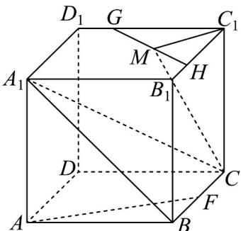
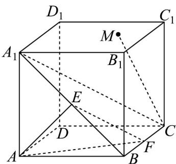

> [!faq]- 《专题8.6 空间直线、平面的垂直（高效培优讲义）》官方解析
>
> > [!success]- **【答案】** (1)可以，作图过程见解析，证明见解析； (2) $\frac{\sqrt{10}}{5}$ .
>
> > [!note]- **【分析】**
> > （1）连接 $C_1M$ ，在平面 $A_{1}B_{1}C_{1}D_{1}$ 上过 $M$ 点作直线 $GH\perp C_1M$ ，则 $GH\perp CM$ ，再利用线面垂直证明
> >
> > 线线垂直即可；
> >
> > (2) 在平面 $ABB_{1}A_{1}$ 上，过点 A 作 $AE \perp A_{1}B$ ，则 E 是 $A_{1}B$ 的中点，先证明 $AE \perp$ 平面 $A_{1}BC$ ，可得 $\angle AFE$ 为斜
> >
> > 线 AF 与平面 $A_{1}BC$ 所成的角，进而可得答案.
>
> > [!note]- **【解析】**
> > （1）过点 M 在面 $A_{1}B_{1}C_{1}D_{1}$ 上能画一条直线，使其与 CM 垂直，
> >
> > 如图所示，连接 $C_1M$ ，在平面 $A_{1}B_{1}C_{1}D_{1}$ 上过 $M$ 点作直线 $GH \perp C_{1}M$
> >
> > 则 $GH \perp CM$ ，
> >
> > 证明：在正方体 $AC_{1}$ 中易得： $CC_{1} \perp$ 面 $A_{1}B_{1}C_{1}D_{1}$
> >
> > 因为 $GH \mid$ 面 $A_{1}B_{1}C_{1}D_{1}$ ，所以 $CC_{1} \perp GH$ .
> >
> > 又因为 $GH \perp C_1M, CC_1 \cap C_1M = C_1$ ，且 $CC_1, C_1M \subset$ 面 $CC_1M$
> >
> > 所以 $GH \perp$ 面 $CC_{1}M$
> >
> > 因为 $CM \subset$ 面 $CC_{1}M$ ，所以 $GH \perp CM$ 。
> >
> > 
> >
> > (2) 在平面 $ABB_{1}A_{1}$ 上，过点 $A$ 作 $AE \perp A_{1}B$ ，则 $E$ 是 $A_{1}B$ 的中点，连接 $EF$
> >
> > 在正方体 $AC_{1}$ 中易得： $BC \perp$ 面 $AA_{1}BB_{1}$
> >
> > 因为 $AE \subset$ 面 $AA_{1}BB_{1}$ ，所以 $BC \perp AE$ ，
> >
> > 因为 $A_{1}B$ I BC = B，且 $A_{1}B, BC \subset$ 面 $A_{1}BC$
> >
> > 所以 $AE \perp$ 面 $A_{1}BC$
> >
> > 所以 EF 为斜线 AF 在平面 $A_{1}BC$ 上的射影，
> >
> > 故 $\angle AFE$ 为斜线 AF 与平面 $A_{1}BC$ 所成的角.
> >
> > 因为 $AE \perp$ 面 $A_{1}BC$ ， $EF \subset$ 面 $A_{1}BC$ ，
> >
> > 所以 $AE \perp EF$ ，
> >
> > 在直角三角形 AEF 中易得 $AF = \sqrt{5}$ , $AE = \sqrt{2}$ ,
> >
> > 所以 $\sin\angle AFE=\frac{AE}{AF}=\frac{\sqrt{2}}{\sqrt{5}}=\frac{\sqrt{10}}{5}$
> >
> > 故直线 AF 与面 $A_{1}BC$ 所成角的正弦值为 $\frac{\sqrt{10}}{5}$ .
> >
> > 
