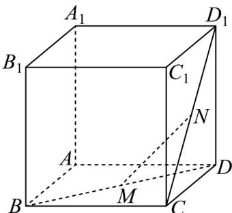

<!-- question-source:start -->
【变式2】如图，在正方体 $ABCD - A_{1}B_{1}C_{1}D_{1}$ 中， $M$ 是 $BD$ 的中点， $N$ 是线段 $CD_{1}$ 上一动点，则下列说法正确

的有（）

A. 无论点 $N$ 在何处，始终有 $BD_{1} \perp MN$ 成立。

B．三棱锥 $N-BAA_{1}$ 的体积随着点 N 的位置的改变而随之变化．

C. 直线 $MN$ 与平面 $ABCD$ 所成角的正切值的取值范围为 $\left[0, \sqrt{2}\right]$

D．平面 BDN 截得正方体 $ABCD - A_{1}B_{1}C_{1}D_{1}$ 的截面可能是三角形或四边形．
<!-- question-source:end -->

![[高中/课堂同步/题库/人教A版高中数学同步讲义(2026)/02_必修第二册/第八章 立体几何初步/专题8.6 空间直线、平面的垂直（高效培优讲义）/题型04_直线与平面所成角/questions/answers/Q00069875A1.md]]
