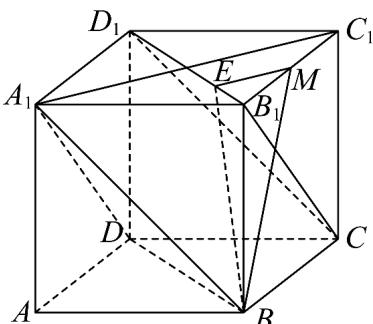
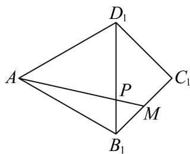
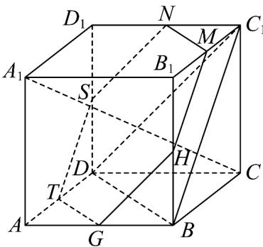

> [!faq]- 《专题8.6 空间直线、平面的垂直（高效培优讲义）》官方解析
>
> > [!success]- **【答案】** BCD
>
> > [!note]- **【分析】**
> > 利用面面平行的判定推理平面 $A_{1}BD//$ 平面 $B_{1}CD_{1}$ ，然后利用直线 $MP$ 与平面 $B_{1}CD_{1}$ 相交判断 $\mathsf{A}$ ；利用定义法作出线面角，并在直角三角形中求出线面角的正弦判断 $\mathsf{B}$ ；把三角形 $AB_{1}D_{1}$ 与三角形 $B_{1}C_{1}D_{1}$ 置于同一平面内，利用余弦定理求出线段 $AM$ 长判断 $\mathsf{C}$ ；先利用线面垂直的判定推理 $A_{1}C \perp$ 平面 $BC_{1}D$ ，取棱的中点利用
> > 面面平行的判定推理得平面 NMSTGH // 平面 $BC_{1}D$ ，进而 $A_{1}C \perp$ 平面 NMSTGH，从而求出点 $Q$ 的轨迹为正六边形 NMSTGH，求解周长即可判断 $\mathsf{D}$ 。
>
> > [!note]- **【解析】**
> > 对于 A：先证平面 $A_{1}BD \parallel$ 平面 $B_{1}CD_{1}$ ，由正方体性质可知 $BB_{1} \parallel DD_{1}$ ，且 $BB_{1} = DD_{1}$ ， $B_{1}A_{1} // CD$ 且 $B_{1}A_{1} = CD$ ，所以四边形 $BB_{1}D_{1}D$ 和 $B_{1}A_{1}DC$ 均为平行四边形，
> >
> > 所以 $BD \parallel B_{1}D_{1}$ ， $B_{1}C \parallel A_{1}D$ ，因为 $BD, A_{1}D \subset$ 平面 $A_{1}BD$
> >
> > $B_{1}D_{1},B_{1}C$ 在平面 $A_{1}BD$ 外，所以 $B_{1}D_{1} //$ 平面 $A_{1}BD$ ， $B_{1}C //$ 平面 $A_{1}BD$
> >
> > 又 $B_{1}D_{1}, B_{1}C \subset$ 平面 $B_{1}CD_{1}$ ， $B_{1}D_{1} \cap B_{1}C = B_{1}$ ，所以平面 $A_{1}BD //$ 平面 $B_{1}CD_{1}$
> >
> > 又 M 为 $B_{1}C_{1}$ 的中点，P 为线段 $B_{1}D_{1}$ 上动点（包括端点），
> >
> > 所以直线 MP 与平面 $B_{1}CD_{1}$ 相交，从而直线 MP 与平面 $A_{1}DB$ 相交，故 A 错误；
> >
> > 对于 B：连接 $A_{1}C_{1}$ ，则 $A_{1}C_{1} \perp B_{1}D_{1}$ ，由 $BB_{1} \perp$ 平面 $A_{1}B_{1}C_{1}D_{1}$ ， $A_{1}C_{1} \subset$ 平面 $A_{1}B_{1}C_{1}D_{1}$
> >
> > 得 $A_{1}C_{1}\perp BB_{1}$ ，又 $BB_{1}\cap B_{1}D_{1} = B_{1}$ ， $BB_{1}$ ， $B_{1}D_{1}\subset$ 平面 $BDD_{1}B_{1}$
> >
> > 则 $A_{1}C_{1}\perp$ 平面 $BDD_{1}B_{1}$ ，过 $M$ 作 $ME / / A_{1}C_{1}$ 交 $B_{1}D_{1}$ 于 $E$ ，连接 $BE$ ，
> >
> > 于是 $ME \perp$ 平面 $BDD_{1}B_{1}$ ， $\angle MBE$ 是直线 $BM$ 与平面 $BDD_{1}B_{1}$ 所成的角， $ME = \frac{1}{4} A_{1}C_{1} = \frac{\sqrt{2}}{2}$
> >
> > $BM = \sqrt{2^2 + 1^2} = \sqrt{5}$ ，所以 $\sin \angle MBE = \frac{ME}{BM} = \frac{\sqrt{10}}{10}$ ，故B正确；
> >
> > 
> >
> > 对于 C，把三角形 $AB_{1}D_{1}$ 与三角形 $B_{1}C_{1}D_{1}$ 置于同一平面内，连接 AM，
> >
> > 则 $AP + MP$ 的最小值为 AM ，
> >
> > 在 $\triangle AB_{1}M$ 中， $\angle AB_{1}M = 60^{\circ} + 45^{\circ} = 105^{\circ}$ ， $AB_{1} = 2\sqrt{2}, B_{1}M = 1$
> >
> > $$
> > \cos \angle A B _ {1} M = \cos (6 0 ^ {\circ} + 4 5 ^ {\circ}) = \frac {\sqrt {2} - \sqrt {6}}{4}
> > $$
> >
> > 由余弦定理得 $AM = \sqrt{\left(2\sqrt{2}\right)^{2} + 1^{2} - 2 \times 2\sqrt{2} \times 1 \times \frac{\sqrt{2} - \sqrt{6}}{4}} = \sqrt{7 + 2\sqrt{3}}$ ，C 正确；
> >
> > 
> >
> > 对于 $^{D}$ ，由正方体的性质知 $AA_{1} \perp$ 平面 ABCD， $BD \subset$ 平面 ABCD，所以 $AA_{1} \perp BD$ ，
> > 因为四边形ABCD为正方形，所以AC⊥BD， $AC\cap AA_{1}=A,AC,AA_{1}\subset$ 平面 $AA_{1}C$ 所以 $BD \perp$ 平面 $AA_{1}C$ ， $A_{1}C \subset$ 平面 $AA_{1}C$ ，所以 $BD \perp A_{1}C$ ，
> >
> > 同理可得 $BC_{1} \wedge A_{1}C$ ， $BC_{1} \cap BD = B, BC_{1}, BD \subset$ 平面 $BC_{1}D$ ，故 $A_{1}C \perp$ 平面 $BC_{1}D$ ；
> >
> > 如图，
> >
> > 
> >
> > 取棱 $C_1D_1, D_1D, DA, AB, BB_1$ 的中点分别为 $N, S, T, G, H$
> >
> > 连接 MN, NS, ST, TG, GH, HM，可得六边形 NMSTGH 为正六边形，
> >
> > 而 $TG // DB$ ， $TG \notin$ 平面 $BC_{1}D$ ， $DB \subset$ 平面 $BC_{1}D$ ，故 $TG //$ 平面 $BC_{1}D$
> >
> > 同理可证 $GH //$ 平面 $BC_{1}D$ ， $TG \cap GH = G$ ， $TG$ ， $GH$ 平面 $NMSTGH$
> >
> > 故平面 NMSTGH // 平面 $BC_{1}D$ ，所以 $A_{1}C \perp$ 平面 NMSTGH，
> >
> > 即过点 $M$ 且与 $A_{1}C$ 垂直的平面截正方体所得截面即为正六边形NMSTGH，边长为 $\sqrt{2}$
> >
> > 其周长为 $6\sqrt{2}$ ，所以点 $Q$ 的轨迹为正六边形 $NMSTGH$ ，则点 $Q$ 的轨迹长度为 $6\sqrt{2}$ ，D 正确。
> >
> > 故选 **BCD**
