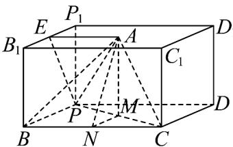

> [!faq]- 《专题8.6 空间直线、平面的垂直（高效培优讲义）》官方解析
>
> > [!success]- **【答案】** $30^{\circ}$
>
> > [!note]- **【分析】**
> > 如图，构建底面边长为 $^{3}$ 和 $^{4}$ 的长方体，将三棱锥放入长方体内，由题可得平面 $AMN // 平面 B_{1}BPP_{1}$
> >
> > 取棱 $B_{1}P_{1}$ 中点为 $E$ ，连结 $AE,EP$ ，可得 $\angle APE$ 等于直线 $AP$ 与平面 $AMN$ 所成的角，据此可得答案
>
> > [!note]- **【解析】**
> > 因为 BC = 3 ， PB = 4 ， PC = 5 ，所以 $\triangle PBC$ 为直角三角形．
> >
> > 如图，构建底面边长为 $^{3}$ 和 $^{4}$ 的长方体，则可将三棱锥放入长方体 $BCDP - B_{1}C_{1}D_{1}P_{1}$ 内，
> >
> > 使得 B, C, P 为长方体的顶点，点 A 在长方体的上底面上。
> >
> > 因为 $AB = AC = AP = 3$ ，则点 $A$ 在底面上的投影到 $B,C,P$ 三点的距离相等，即点 $M$ 为点 $A$ 在底面上的投影，
> >
> > $M, A$ 分别为下底面，上底面对角线交点·
> >
> > 则 $AM \perp$ 平面 BCDP，又 $B_{1}B \perp$ 平面 BCDP，则 $AM \parallel B_{1}B$ .
> >
> > 又 $MN //BP$ ， $MN, AM \subset$ 平面 $AMN$ ， $B_{1}B, BP \subset$ 平面 $B_{1}BPP_{1}$
> >
> > $MN \cap AM = M, B_{1}B \cap BP = B$ ，则平面 $AMN // 平面 B_{1}BPP_{1}$
> >
> > 如图，取棱 $B_{1}P_{1}$ 中点为 $E$ ，连结 $AE,EP$ ，则 $AE\perp$ 平面 $B_{1}BPP_{1}$ ，∠APE等于直线AP与平面AMN所成的角.
> >
> > 又因为 $AP = 3$ ， $BC = 2EA = 3 \Rightarrow EA = \frac{3}{2}$ ，所以 $\sin \angle APE = \frac{AE}{AP} = \frac{1}{2}$
> >
> > 又由图可得 $\angle APE$ 为锐角，则 $\angle APE = 30^{\circ}$ ，从而直线 $AP$ 与平面 $AMN$ 所成的角为 $\angle APE = 30^{\circ}$ 。
> >
> > 
