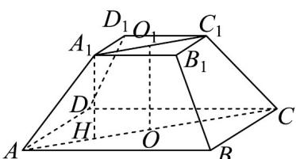

## 题型04 直线与平面所成角

【典例1】已知在正四棱台 $ABCD - A_{1}B_{1}C_{1}D_{1}$ 中， $AB = 6$ ， $A_{1}B_{1} = 2$ ， $A_{1}A$ 与平面 $ABCD$ 所成角的正弦值为 $\frac{1}{3}$ ，则此正四棱台的体积为（）A. $\frac{40}{3}$ B. $\frac{52}{3}$ C. $\frac{80\sqrt{2}}{3}$ D. $\frac{102\sqrt{2}}{3}$

【答案】B

【分析】过 $A_{1}$ 作 $A_{1}H \perp AC$ 于 $H$ ，根据正棱台的性质可得 $A_{1}H \perp$ 底面 $ABCD$ ，结合线面夹角的定义可得 $\sin \angle A_{1}AH = \frac{1}{3}$ ，从而利用平方关系与商数关系得 $\tan \angle A_{1}AH$ ，求得 $A_{1}H$ 的值，再利用棱台体积公式即可得所求·

【详解】如图，过 $A_{1}$ 作 $A_{1}H \perp AC$ 于 H，

由正四棱台的性质知 $A_{1}H \perp$ 底面 ABCD，

因为 $A_{1}A$ 与平面 ABCD 所成角的正弦值为 $\frac{1}{3}$ ，所以 $\sin\angle A_{1}AH=\frac{1}{3}$ ，

又 $\angle A_{1}AH$ 为锐角，所以 $\cos\angle A_{1}AH=\sqrt{1-\sin^{2}\angle A_{1}AH}=\frac{2\sqrt{2}}{3}$

从而 $\tan\angle A_{1}AH=\frac{\sin\angle A_{1}AH}{\cos\angle A_{1}AH}=\frac{1}{2\sqrt{2}}=\frac{\sqrt{2}}{4}$

由题设可得 $AH = \frac{AC - A_{1}C_{1}}{2} = \frac{6\sqrt{2} - 2\sqrt{2}}{2} = 2\sqrt{2}$ ，所以 $A_{1}H = AH \cdot \tan \angle A_{1}AH = 1$

故正四棱台的体积 $V=\frac{1}{3}\left(S_{\text{上}}+S_{\text{下}}+\sqrt{S_{\text{上}}S_{\text{下}}}\right)h=\frac{4+36+\sqrt{4\times36}}{3}\times1=\frac{52}{3}$

故选：B.

## 方法技巧

求平面的斜线与平面所成的角的一般步骤

(1) 确定斜线与平面的交点（斜足）；

（2）通过斜线上除斜足以外的某一点作平面的垂线，连接垂足和斜足即为斜线在平面上的射影，则斜线和射

影所成的锐角即为所求的角；

(3) 求解由斜线、垂线、射影构成的直角三角形.

![[高中/课堂同步/题库/人教A版高中数学同步讲义(2026)/02_必修第二册/第八章 立体几何初步/专题8.6 空间直线、平面的垂直（高效培优讲义）/题型04_直线与平面所成角/questions/Q00069874.md]]
![[高中/课堂同步/题库/人教A版高中数学同步讲义(2026)/02_必修第二册/第八章 立体几何初步/专题8.6 空间直线、平面的垂直（高效培优讲义）/题型04_直线与平面所成角/questions/Q00069875.md]]
![[高中/课堂同步/题库/人教A版高中数学同步讲义(2026)/02_必修第二册/第八章 立体几何初步/专题8.6 空间直线、平面的垂直（高效培优讲义）/题型04_直线与平面所成角/questions/Q00069876.md]]
