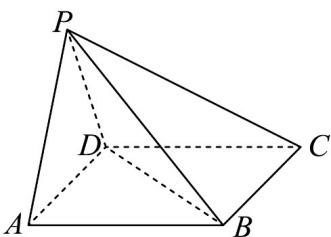

<!-- question-source:start -->
【变式1】如图，在四棱锥 $P - ABCD$ 中， $\triangle PAD$ 为等边三角形，四边形 $ABCD$ 是菱形， $AB = 4$

$$
\angle B A D = 6 0 ^ {\circ} \quad P B = 2 \sqrt {6}
$$

(1)证明：平面 $PAD \perp$ 平面ABCD.

(2)求点 A 到平面 PBD 的距离.
<!-- question-source:end -->

![[高中/课堂同步/题库/人教A版高中数学同步讲义(2026)/02_必修第二册/第八章 立体几何初步/专题8.6 空间直线、平面的垂直（高效培优讲义）/题型06_面面垂直判定定理的应用/questions/answers/Q00069880A1.md]]
