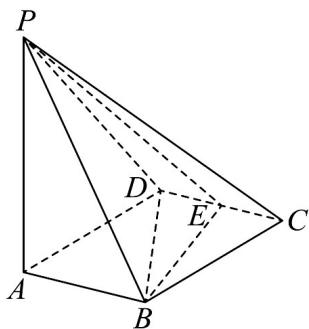

> [!faq]- 《专题8.6 空间直线、平面的垂直（高效培优讲义）》官方解析
>
> > [!success]- **【答案】** (1)证明见解析 (2) $\frac{\sqrt{5}}{5}$
>
> > [!note]- **【分析】**
> > （ $^{1}$ ）连接 BD，证明出 $BE \perp$ 平面 PAB，再利用面面垂直的判定定理可证得结论成立；
> >
> > (2) 求出 VBDE、 $\triangle PBE$ 的面积，利用等体积法可求得点 D 到平面 PBE 的距离.
>
> > [!note]- **【解析】**
> > （1）连接 $BD$ ，由四边形ABCD是边长为1的菱形， $\angle BCD = 60^{\circ}$
> >
> > 所以， $BC = CD$ ，可知 $\triangle BCD$ 是正三角形
> >
> > 因为 E 是 CD 的中点，所以 $BE \perp CD$
> >
> > 又 $AB \parallel CD$ ，所以 $AB \perp BE$ .
> >
> > 因为 $PA \perp$ 底面 ABCD， $BE \subset$ 平面 ABCD，所以 $PA \perp BE \cdot$
> >
> > 又 PA 、 AB ⊂ 平面 PAB ， AB ∩ PA = A ，所以 BE ⊥ 平面 PAB ，
> >
> > 又 $BE \subset$ 平面 $PBE$ ，所以平面 $PBE \perp$ 平面 $PAB$ .
> >
> > (2) 因为 $PA \perp$ 底面 ABCD， $AB \subset$ 平面 ABCD，所以 $PA \perp AB \cdot$
> >
> > 
> >
> > 又 $PA = 2$ ， $AB = 1$ ，所以 $PB = \sqrt{PA^2 + AB^2} = \sqrt{2^2 + 1^2} = \sqrt{5}$
> >
> > 在正三角形 $BCD$ 中， $BC = 1$ ， $E$ 是 $CD$ 的中点，所以 $BE \perp CD$ ，且 $BE = BC \sin 60^\circ = \frac{\sqrt{3}}{2}$ 。
> >
> > 因为 $BE \perp$ 平面 PAB ， $PB \subset$ 平面 PAB ，所以 $BE \perp PB$
> >
> > 所以 $S_{\triangle PBE} = \frac{1}{2} PB \cdot BE = \frac{1}{2} \times \sqrt{5} \times \frac{\sqrt{3}}{2} = \frac{\sqrt{15}}{4}$ .
> >
> > 因为 $V_{D-PBE} = V_{P-BDE}$ ，PA ⊥ 底面 ABCD，
> >
> > 设点 D 到平面 PBE 的距离为 d，所以 $\frac{1}{3}S_{\triangle PBE} \cdot d = \frac{1}{3}S_{\triangle BDE} \cdot PA$
> >
> > 而 $S_{\triangle BDE} = \frac{1}{2} DE \cdot BE = \frac{1}{2} \times \frac{1}{2} \times \frac{\sqrt{3}}{2} = \frac{\sqrt{3}}{8}$ .
> >
> > 所以 $d=\frac{S_{\triangle BDE}\cdot PA}{S_{\triangle BPE}}=\frac{\frac{\sqrt{3}}{8}\times2}{\frac{\sqrt{15}}{4}}=\frac{\sqrt{5}}{5}$ ，即点到平面的距离为 $\frac{\sqrt{5}}{5}$
