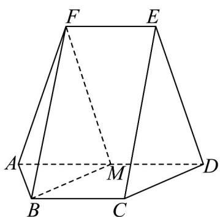

<!-- question-source:start -->
【变式2】如图，在以 $A,B,C,D,E,F$ 为顶点的五面体中，四边形ABCD与四边形ADEF均为等腰梯形，

$BC / / AD, EF / / AD$ ， $AD = 4$ ， $AB = BC = EF = 2$ ， $ED = \sqrt{7}$ ， $FB = 3$ ， $M$ 为 $AD$ 的中点.

(1)证明：平面 $BMF / /$ 平面 $CDE$ ；

(2)求平面 $ABF$ 与平面 $CDE$ 所成角的正弦值；

(3)求点 $M$ 到平面 $ABF$ 的距离.
<!-- question-source:end -->

![[高中/课堂同步/题库/人教A版高中数学同步讲义(2026)/02_必修第二册/第八章 立体几何初步/专题8.6 空间直线、平面的垂直（高效培优讲义）/题型07_求二面角/questions/answers/Q00069884A1.md]]
