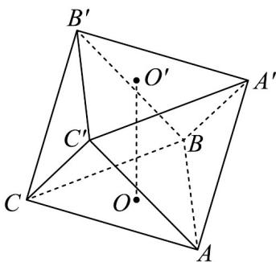
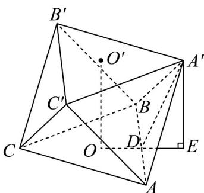
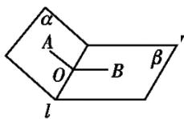
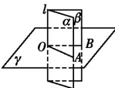
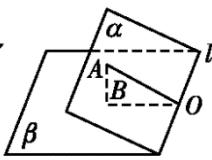

## 题型07 求二面角

【典例1】如图，一个水平放置的边长为 $\sqrt{3}$ 的等边三角形 $ABC$ 绕着中心点 $O$ 逆时针旋转 $\frac{\pi}{3}$ ，再沿竖直方向 $\left( \begin{array}{c} \square \\ OO' \end{array} \right)$ 平移一定距离后，连接 $AA'$ ， $AC'$ ， $BB'$ ， $BA'$ ， $CC'$ ， $CB'$ ，此时侧面三角形 $AA'B$ ， $A'BB'$ ， $BB'C$ ， $ACC'$ 正好都是等边三角形。

(1)证明：平面 $B^{\prime}C^{\prime}C / /$ 平面 $AA^{\prime}B$

(2)求平面 $A^{\prime}B^{\prime}C^{\prime}$ 与平面 $A^{\prime}AB$ 所成角的余弦值.

【答案】(1)证明见解析 (2) $\frac{1}{3}$

【分析】（1）依据题意可知 $B^{\prime}C^{\prime}//AB$ ， $A^{\prime}B//C^{\prime}C$ ，然后根据面面平行的判定定理可得结果；

(2) 通过等价转化为平面 $ABC$ 与平面 $A'AB$ 所成的角，然后通过作图找到角 $\angle A'DE$ ，并计算 $DE, A'D$ 可得结

果·

【详解】（1）由题意可得 $B^{\prime}C^{\prime}//AB$ ，且 $B^{\prime}C^{\prime}=AB$ ，所以四边形 $ABB^{\prime}C^{\prime}$ 为平行四边形，

同理， $A^{\prime}C^{\prime}$ 与 BC 平行且相等，所以四边形 $A^{\prime}BCC^{\prime}$ 为平行四边形，故 $A^{\prime}B//C^{\prime}C$

又 $B^{\prime}C^{\prime}\cap CC^{\prime} = C^{\prime}$ ， $AB\cap A^{\prime}B = B$ ， $B^{\prime}C^{\prime},CC^{\prime}\subset$ 平面 $B^{\prime}C^{\prime}C$ ， $AB,A^{\prime}B\subset$ 平面 $AA^{\prime}B$

所以平面 $AA'B \parallel$ 平面 $B'C'C$ .

(2) 由平面 $B^{\prime}C^{\prime}C / /$ 平面 $AA^{\prime}B$ ，得平面 $A^{\prime}B^{\prime}C^{\prime}$ 与平面 $A^{\prime}AB$ 所成的角 $\alpha$ 即为平面 $ABC$ 与平面 $A^{\prime}AB$ 所成的角。如图，作点 $A^{\prime}$ 在平面 $ABC$ 上的投影 $E$ ，连接 $OE$ ，交 $AB$ 于点 $D$ ，连接 $A^{\prime}D$ ， $A^{\prime}E$ ，可知 $DE \perp AB$ ，则 $\angle A^{\prime}DE$ 即为二面角 $A^{\prime} - AB - C$ 的平面角。

因为 $EO = A'O'$ ，所以 $DE = \frac{1}{2} AO = \frac{1}{2}$ ， $A'D = AB \cdot \sin \frac{\pi}{3} = \frac{3}{2}$ ，故 $\cos \alpha = \frac{DE}{A'D} = \frac{\frac{1}{2}}{\frac{3}{2}} = \frac{1}{3}$ .

## 方法技巧

## 作二面角的三种常用方法

(1) 定义法：在二面角的棱上找一个特殊点，在两个半平面内分别作垂直于棱的射线．如图①，则 $\angle AOB$

为二面角 $\alpha - l - \beta$ 的平面角.

图①

图②

图③

（2）垂直法：过棱上一点作棱的垂直平面，该平面与二面角的两个半平面产生交线，这两条交线所成的角，

即为二面角的平面角．如图②，∠AOB为二面角 $\alpha-l-\beta$ 的平面角．

（3）垂线法：过二面角的一个面内异于棱上的一点 $A$ 向另一个平面作垂线，垂足为 $B$ ，由点 $B$ 向二面角的

棱作垂线，垂足为 $O$ ，连接 $AO$ ，则 $\angle AOB$ 为二面角的平面角或其补角．如图③， $\angle AOB$ 为二面角 $\alpha -l - \beta$

的平面角.

![[高中/课堂同步/题库/人教A版高中数学同步讲义(2026)/02_必修第二册/第八章 立体几何初步/专题8.6 空间直线、平面的垂直（高效培优讲义）/题型07_求二面角/questions/Q00069883.md]]
![[高中/课堂同步/题库/人教A版高中数学同步讲义(2026)/02_必修第二册/第八章 立体几何初步/专题8.6 空间直线、平面的垂直（高效培优讲义）/题型07_求二面角/questions/Q00069884.md]]
![[高中/课堂同步/题库/人教A版高中数学同步讲义(2026)/02_必修第二册/第八章 立体几何初步/专题8.6 空间直线、平面的垂直（高效培优讲义）/题型07_求二面角/questions/Q00069885.md]]
