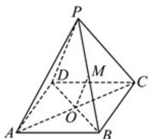

<!-- question-source:start -->
9. 如图， $P$ 为矩形 $ABCD$ 所在平面外一点， $O$ 是 $AC$ 的中点， $M$ 是线段 $PB$ 上的点， $OM//$ 平面 $PDA$ ，则

下列说法正确的是（ ）

A. PM:PB=1:2 B. OM//平面PCD

C. $OM / /$ 平面PBA D. $OM / /$ 平面PAC
<!-- question-source:end -->

![[高中/课堂同步/题库/人教A版高中数学同步讲义(2026)/02_必修第二册/第八章 立体几何初步/单元测试/第八章_立体几何初步_高效培优单元自测_强化卷_/一_选择题_sec_02/questions/answers/Q00065285A1.md]]
