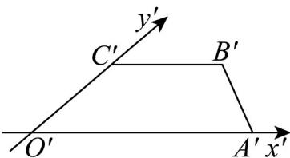
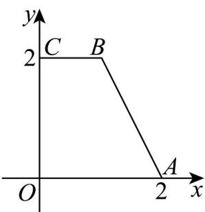

> [!faq]- 《第八章_立体几何初步_高效培优单元自测_强化卷_》官方解析
>
> > [!success]- **【答案】**  A. 3 B. $\frac{3}{2}$ C. 6 D. 4
>
> > [!note]- **【分析】**
> > 根据斜二测画法得出 $OC = 2O'C' = 2$ ， $BC = B'C' = 1$ ， $OA = O'A' = 2$ ，由此即可得解
>
> > [!note]- **【解析】**
> > 将直观图 $O'A'B'C'$ 还原，如下图·四边形 OABC 是直角梯形，
> >
> > 上、下底分别为 $BC = 1$ ， $OA = 2$ ，高 $OC = 2$
> >
> > 所以四边形OABC的面积 $S=\frac{(1+2)\times2}{2}=3$
> >
> > 故选：A.
> >
> > 
