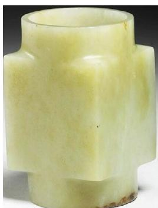
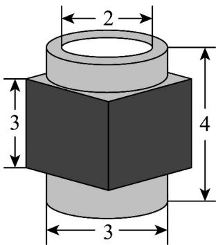
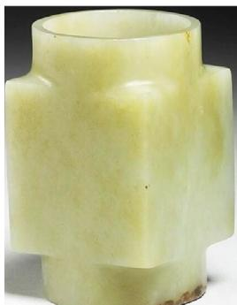
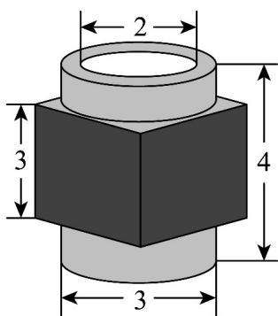
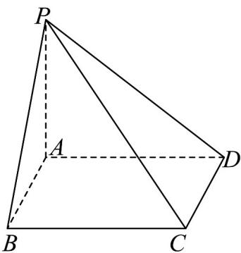
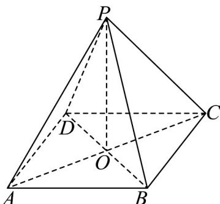

> [!faq]- 《第八章_立体几何初步_高效培优单元自测_强化卷_》官方解析
>
> > [!success]- **【答案】** A
>
> > [!note]- **【分析】**
> > 利用空间的平行与垂直的判定和性质定理可作出各选项判断·
>
> > [!note]- **【解析】**
> > 因为 $m \parallel \alpha$ ，所以平面 $\alpha$ 内必存在直线 $e \parallel m$ ，
> >
> > 又因为 $m \perp \beta$ ，所以 $e \perp \beta$ ，即 $\alpha \perp \beta$ ，故 A 正确；
> >
> > 根据题意虽然平面 $\beta$ 内有直线 $m^{\prime}$ 与 $m$ 平行，也有直线 $n^{\prime}$ 与 $n$ 平行，
> >
> > 但 $m^{\prime}, n^{\prime}$ 不一定是相交直线，所以虽然有 $l \perp m^{\prime}$ ， $l \perp n^{\prime}$ ，也不能推出 $l \perp \beta$
> >
> > 所以也就不能推出 $\alpha \perp \beta$ ，故 B 错误；
> >
> > 虽然 $m \subset \alpha, m \subset \beta$ ，但仅由一条直线 $m / / \gamma$ ，是不能推出 $\alpha / / \gamma$ ， $\beta / / \gamma$ ，故 $C$ 错误；
> >
> > 虽然 $\alpha // \beta$ ， $l \subset \alpha$ ， $m \subset \beta$ ，但不能确定 $l, m$ 是否在一个平面内，所以不能推出 $l // m$ ，故 $^{\text{D}}$ 错误；
> >
> > 故选：A.
> >
> > 4．三星堆遗址，位于四川省广汉市，距今约三千到五千年．2021年2月4日，在三星堆遗址祭祀坑区4
> >
> > 号坑发现了玉琮．玉琮是一种内圆外方的圆筒型玉器，是一种古人用于祭祀的礼器．假定某玉琮中间内空．
> >
> > 形状对称，如图所示，圆筒内径长 $2\mathrm{cm}$ ，外径长 $3\mathrm{cm}$ ，筒高 $4\mathrm{cm}$ ，中部为棱长是 $3\mathrm{cm}$ 的正方体的一部分，
> >
> > 圆筒的外侧面内切于正方体的侧面，则该玉琮的体积为（）
> >
> > 
> >
> > 
> >
> > A. $\left(27 - \frac{7\pi}{4}\right)\mathrm{cm}^3$ B. $\left(24 + \frac{\pi}{4}\right)\mathrm{cm}^3$ C. $\left(36 - \frac{9\pi}{4}\right)\mathrm{cm}^3$ D. $\left(18 + \frac{7\pi}{4}\right)\mathrm{cm}^3$
> >
> > 【答案】A
> >
> > 【分析】利用组合体体积减去圆柱体体积就可得结果·
> >
> > 【详解】
> >
> > 
> >
> > 
> >
> > 计算正方体体积： $3 \times 3 \times 3 = 27$
> >
> > 计算上下两个圆柱的体积： $\pi \left(\frac{3}{2}\right)^2\times 1 = \frac{9}{4}\pi$
> >
> > 再计算内空圆柱的体积： $\pi\times1^{2}\times4=4\pi$
> >
> > 最后可得组合体体积： $27 + \frac{9}{4}\pi - 4\pi = 27 - \frac{7}{4}\pi (\mathrm{cm}^3)$
> >
> > 故选：A
> >
> > 5. 古代数学名著《九章算术·商功》中，将底面为矩形·且有一条侧棱与底面垂直的四棱锥称为阳马，将四
> > 个面都为直角三角形的三棱锥称为鳖臑·若四棱锥 P-ABCD 为阳马，PA⊥平面 ABCD，AB=BC=4，
> > PA=3，则此“阳马”外接球的体积为（）
> >
> > 
> >
> > A. $\frac{41\sqrt{41}\pi}{6}$ B. $\frac{\sqrt{41}\pi}{2}$ C. $\sqrt{41}\pi$ D. $\frac{41\pi}{4}$
> >
> > 【答案】A
> >
> > 【分析】依题意四棱锥 P-ABCD 可补形为长方体，求出长方体的体对角线即为外接球的直径，从而求出外接球的体积
> >
> > 【详解】由于 $PA \perp$ 平面 ABCD， $AB, AD \subset$ 平面 ABCD，所以 $PA \perp AB, PA \perp AD$ ，
> > 由于四边形 ABCD 是矩形，所以 $AB \perp AD$ ，
> > 所以 AB, AD, PA 两两相互垂直，
> > 所以四棱锥 P-ABCD 可补形为长方体，且长方体的体对角线为 $PC = \sqrt{3^{2} + 4^{2} + 4^{2}} = \sqrt{41}$ ，
> > 所以四棱锥 P-ABCD 的外接球的直径 $2R = \sqrt{41}$ ，即 $R = \frac{\sqrt{41}}{2}$ ，
> >
> > 所以四棱锥 $P - ABCD$ 的外接球的体积 $V = \frac{4\pi R^3}{3} = \frac{4\pi}{3} \times \left(\frac{\sqrt{41}}{2}\right)^3 = \frac{41\sqrt{41}\pi}{6}$ . 故选：A
> >
> > 6. 正四棱锥 $P - ABCD$ 的侧棱长为 $2$ ，侧棱 $PA$ 与底面 $ABCD$ 所成角为 $45^{\circ}$ ，则该四棱锥的体积为（）A. $\frac{2\sqrt{2}}{3}$ B. $2\sqrt{2}$ C. $\frac{4\sqrt{2}}{3}$ D. $4\sqrt{2}$
> >
> > 【答案】C
> >
> > 【分析】正方形ABCD的对角线相交于点O，连接PO，易得 $PO \perp$ 平面ABCD， $\angle PAO$ 为PA与底面ABCD所成角，根据侧棱长，求得正四棱锥的高和底面边长，代入体积公式求解.
> >
> > 【详解】如图所示：
> >
> > 
> >
> > 正四棱锥 P-ABCD 中，正方形 ABCD 的对角线相交于点 O，连接 PO，
> > 则 $PO \perp$ 平面 ABCD，则 $\angle PAO$ 为 PA 与底面 ABCD 所成角，且 $\angle PAO = 45^{\circ}$ ，
> > 所以 $PO = PA \sin 45^{\circ} = \sqrt{2}$ ，且 AC = 2OA = 2OP = $2\sqrt{2}$ ，所以 AB = 2，
> > 所以该四棱锥的体积为 $V=\frac{1}{3}AB\cdot BC\cdot OP=\frac{4\sqrt{2}}{3}$
> >
> > 故选 **C**.
