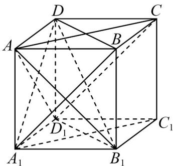

> [!faq]- 《第八章_立体几何初步_高效培优单元自测_强化卷_》官方解析
>
> > [!success]- **【答案】**  A. $CD_{1} / /$ 平面 $A_{1}BD$ B. $AD_{1}\perp$ 平面 $A_{1}B_{1}D$ C. $CD_{1}$ 与 $BD$ 所成的角为 $60^{\circ}$ D.点 $D$ 到平面 $ACD_{1}$ 的距离为 $\frac{1}{3}$
>
> > [!note]- **【分析】**
> > 本题用几何判定定理和体积法，分别验证线面平行、线面垂直、异面直线夹角和点到平面距离，
> >
> > 从而判断各选项的正误·
>
> > [!note]- **【解析】**
> > 选项 A：因为 $CD_{1} // A_{1}B$ ，且 $CD_{1} \notin$ 平面 $A_{1}BD$ ， $A_{1}B \subset$ 平面 $A_{1}BD$
> >
> > 由线面平行判定定理，可得 $CD_{1} \parallel$ 平面 $A_{1}BD$ ，所以 $^{A}$ 正确；
> >
> > 选项 B，在正方体中， $AD_{1}\text{？}A_{1}D$ ， $AD_{1}\text{？}A_{1}B_{1}$
> >
> > 又 $A_{1}D \cap A_{1}B_{1} = A_{1}$ ，且 $A_{1}D, A_{1}B_{1} \subset$ 平面 $A_{1}B_{1}D$
> >
> > 由线面垂直判定定理，可得 $AD_{1}$ 平面 $A_{1}B_{1}D$ ，所以 B 正确；
> >
> > 选项 C，因为 $CD_{1} // A_{1}B$ ，所以 $CD_{1}$ 与 BD 所成的角等于 $A_{1}B$ 与 BD 所成的角。
> >
> > 在正三角形 $A_{1}BD$ 中， $\angle A_{1}BD = 60^{\circ}$ ，所以 C 正确；
> >
> > 选项 D：设点 D 到平面 $ACD_{1}$ 的距离为 h，
> >
> > 三棱锥 $D-ACD_{1}$ 的体积： $V_{D-ACD_{1}}=V_{D_{1}-ACD}=\frac{1}{3}\times\frac{1}{2}\times1\times1\times1=\frac{1}{6}$
> >
> > 平面 $ACD_{1}$ 是边长为 $\sqrt{2}$ 的正三角形，面积为 $S_{\triangle ACD_1} = \frac{\sqrt{3}}{4} \times (\sqrt{2})^2 = \frac{\sqrt{3}}{2}$
> >
> > 由体积公式 $V = \frac{1}{3} Sh$ 得： $\frac{1}{6} = \frac{1}{3} \times \frac{\sqrt{3}}{2} \times h \Rightarrow h = \frac{\sqrt{3}}{3} \neq \frac{1}{3}$ ，所以 D 错误.
> >
> > 故选 **ABC**
