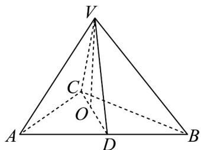

<!-- question-source:start -->
16．（15分）如图，在四面体V-ABC中，AC=BC，从顶点V作平面ABC的垂线，垂足O恰好落在 $V_{ABC}$ 的中线 CD 上.

(1)如果 $DV = DA = 2$ ，直线 $VD$ 与平面 $ABC$ 所成的角为 $\frac{\pi}{4}$ ，求直线 $VA$ 与平面 $ABC$ 所成角的大小；

(2)证明：平面 $VCD \perp$ 平面 $VAB$ .
<!-- question-source:end -->

![[高中/课堂同步/题库/人教A版高中数学同步讲义(2026)/02_必修第二册/第八章 立体几何初步/单元测试/第八章_立体几何初步_高效培优单元自测_强化卷_/三_填空题_sec_04/questions/answers/Q00065291A1.md]]
