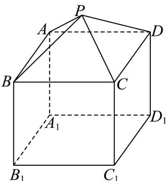

<!-- question-source:start -->
17．（15分）如图，某种“笼具”由上、下两层组成，上层和下层分别是正四棱锥 $P - ABCD$ 和长方体

$$
A B C D - A _ {1} B _ {1} C _ {1} D _ {1}, A B = B C = 3 0 \mathrm{cm}, B P = B B _ {1} = 2 5 \mathrm{cm}
$$

(1)求这种“笼具”的表面积；

(2)求这种“笼具”的体积.
<!-- question-source:end -->

![[高中/课堂同步/题库/人教A版高中数学同步讲义(2026)/02_必修第二册/第八章 立体几何初步/单元测试/第八章_立体几何初步_高效培优单元自测_强化卷_/三_填空题_sec_04/questions/answers/Q00065292A1.md]]
