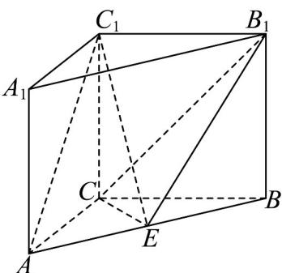

<!-- question-source:start -->
18．（17分）如图，在直三棱柱 $ABC-A_{1}B_{1}C_{1}$ 中， $AC=CB=CC_{1}=2$ ，点E为AB的中点·在VABC中，内

角 $A, B, C$ 的对边分别为 $a, b, c$ ，若 $\mathrm{V}ABC$ 的面积为 $\frac{\sqrt{3}\left(c^2 - b^2 - a^2\right)}{4}$ .

(1)求证： $AC_{1} //$ 平面 $B_{1}CE$ ；

(2)求 $\angle ACB$

(3)求三棱锥 $E - CBB_{1}$ 的体积.
<!-- question-source:end -->

![[高中/课堂同步/题库/人教A版高中数学同步讲义(2026)/02_必修第二册/第八章 立体几何初步/单元测试/第八章_立体几何初步_高效培优单元自测_强化卷_/三_填空题_sec_04/questions/answers/Q00065293A1.md]]
