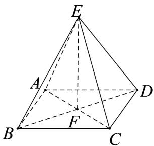

> [!faq]- 《第八章_立体几何初步_高效培优单元自测_强化卷_》官方解析
>
> > [!success]- **【答案】** $72\sqrt{2}\pi$
>
> > [!note]- **【分析】**
> > 由 EF = FA = FB = FC = FD = $3\sqrt{2}$ ，得正四棱锥 E - ABCD 的外接球球心为 F，半径为 $3\sqrt{2}$ ，可
> >
> > 求外接球的体积·
>
> > [!note]- **【解析】**
> > 正四棱锥 E-ABCD 中，设 $AC \cap BD = F$ ，连接 EF，则 $EF \perp$ 平面 ABCD
> >
> > 设正四棱锥 E-ABCD 的外接球球心为 O，则 O 在直线 EF 上，
> >
> > 因为正四棱锥 $E - ABCD$ 的高为 $3\sqrt{2}$ ，所以 $EF = 3\sqrt{2}$
> >
> > 底面正方形 ABCD 的边长为 6，则有 FA = FB = FC = FD = $3\sqrt{2}$ ，所以 F 即为 O，
> >
> > 正四棱锥 $E - ABCD$ 的外接球半径为 $3\sqrt{2}$ ，外接球的体积为 $\frac{4}{3}\pi (3\sqrt{2})^3 = 72\sqrt{2}\pi$
> >
> > 
> >
> > 故答案为： $72\sqrt{2}\pi$
