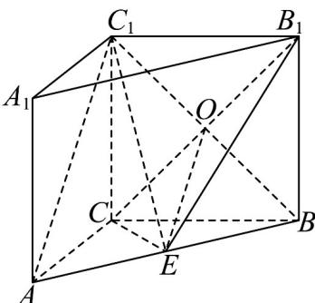

> [!faq]- 《第八章_立体几何初步_高效培优单元自测_强化卷_》官方解析
>
> > [!success]- **【答案】** (1)证明见解析(2) $\frac{2\pi}{3}$ (3) $\frac{\sqrt{3}}{3}$
>
> > [!note]- **【分析】**
> > （1）连接 $BC_{1}$ ，利用中位线性质可得 $OE // AC_{1}$ ，再用线面平行判定可证结论成立；
> >
> > (2) 三角形面积公式结合余弦定理，化简可得 $\tan C$ 取值，从而得角的大小；
> >
> > (3) 三棱锥换底，以 $\triangle BCE$ 为底， $BB_{1}$ 为高，根据体积公式计算可得结果
>
> > [!note]- **【解析】**
> > （1）
> >
> > 
> >
> > 连接 $BC_{1}$ ，设 $C_{1}B \cap CB_{1} = O$ ，连接 OE，
> >
> > 在直三棱柱 $ABC - A_{1}B_{1}C_{1}$ 中，
> >
> > 四边形 $BB_{1}C_{1}C$ 为平行四边形，则 O 为 $BC_{1}$ 的中点，
> >
> > 又因为 $E$ 为 $AB$ 的中点，则 $OE \parallel AC_{1}$
> >
> > 又因为 $AC_{1} \notin$ 平面 $B_{1}CE, OE \subset$ 平面 $B_{1}CE$
> >
> > 所以 $AC_{1}$ // 平面 $B_{1}CE$ .
> >
> > (2) 在 VABC 中，由 $S_{\triangle ABC} = \frac{1}{2} ab \sin C = \frac{\sqrt{3}(c^{2} - b^{2} - a^{2})}{4} = -\frac{\sqrt{3}}{4}(b^{2} + a^{2} - c^{2})$
> >
> > 又由余弦定理 $\cos C = \frac{b^2 + a^2 - c^2}{2ab}$ ，可得 $\frac{1}{2} ab\sin C = -\frac{\sqrt{3}}{4}\cdot 2ab\cos C$
> >
> > 所以 $\tan C = -\sqrt{3}$
> >
> > 又由 $C \in (0, \pi)$ ，可得 $C = \frac{2\pi}{3}$
> >
> > 即 $\angle ACB = \frac{2\pi}{3}$ .
> >
> > (3) 由直三棱柱可知，三棱锥 $B_{1} - BCE$ 的高为 $BB_{1}$ ， $BB_{1} = CC_{1} = 2$
> >
> > 在VABC中，AC=BC=2，E为AB的中点，由（1）知 $\angle ACB=\frac{2\pi}{3}$
> >
> > 所以 $S_{\triangle BCE} = \frac{1}{2} S_{\triangle ACB} = \frac{1}{2} \times \frac{1}{2} CA \cdot CB \cdot \sin \angle ACB = \frac{1}{2} \times \frac{1}{2} \times 2 \times 2 \times \frac{\sqrt{3}}{2} = \frac{\sqrt{3}}{2}$ .
> >
> > 因此 $V_{E-CBB_{1}} = V_{B_{1}-BCE} = \frac{1}{3} S_{\triangle BCE} \cdot BB_{1} = \frac{1}{3} \times \frac{\sqrt{3}}{2} \times 2 = \frac{\sqrt{3}}{3}$ .
