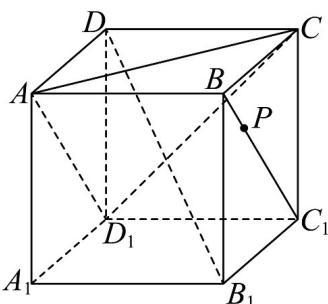
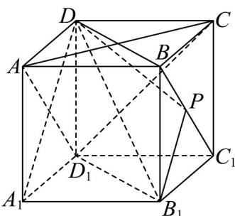
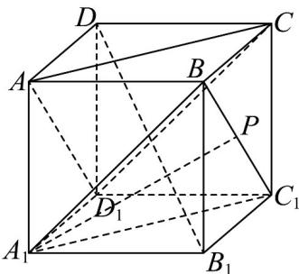
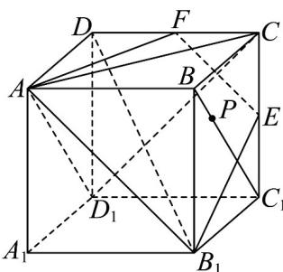

> [!faq]- 《第八章_立体几何初步_高效培优单元自测_提升卷_》官方解析
>
> > [!success]- **【答案】**  A. 平面 $PB_{1}D \perp$ 平面 $ACD_{1}$ B. $A_{1}P / /$ 平面 $ACD_{1}$ C. 异面直线 $A_{1}P$ 与 $AD_{1}$ 所成角的取值范围是 $\left(0, \frac{\pi}{3}\right]$ D．若 E 点为棱 $CC_{1}$ 的中点，则由 A， $B_{1}$ ，E 三点确定的平面与正方体相交形成的截面周长为 $\sqrt{5} + \frac{3\sqrt{2}}{2}$
>
> > [!note]- **【分析】**
> > 由面面垂直的判定定理可判断 $^{A}$ ，由面面平行的性质定理可判断 $^{B}$ ，由线面垂直的性质定理可判
> >
> > 断 $^{C}$ ，由基本事实 $^{1}$ 作出由A， $B_{1}$ ，E三点确定的平面与正方体相交形成的截面，计算各边长度后可判断
> >
> > D.
>
> > [!note]- **【解析】**
> > 对于 A，正方体中由 $DD_{1} \perp$ 平面 ABCD， $AC \subset$ 平面 ABCD，可得 $DD_{1} \perp AC$
> >
> > 又 $AC \perp BD$ ， $DD_{1}, BD \subset$ 平面 $BDD_{1}B_{1}$ 且 $DD_{1}I\cdot BD = D$
> >
> > 所以 $AC \perp$ 平面 $BDD_{1}B_{1}$
> >
> > 因为 $B_{1}D \subset$ 平面 $BDD_{1}B_{1}$ ，所以 $AC \perp B_{1}D$
> >
> > 因为 $B_{1}D$ 在平面 $AA_{1}D_{1}D$ 内的投影为 $A_{1}D$
> >
> > 而 $A_{1}D \perp AD_{1}$ ，所以 $AD_{1} \perp B_{1}D$
> >
> > 因为 $AC \, I \, AD_{1} = A$ ， $AC, AD_{1} \subset \text{平面 } ACD_{1}$
> >
> > 所以 $B_{1}D \perp$ 平面 $ACD_{1}$
> >
> > 因为 $B_{1}D \subset$ 平面 $PB_{1}D$ ，所以平面 $PB_{1}D \perp$ 平面 $ACD_{1}$ ，故 A 正确；
> >
> > 
> >
> > 对于 $^{B}$ ，正方体中AB与 $C_{1}D_{1}$ 平行且相等，则 $ABC_{1}D_{1}$ 是平行四边形，
> >
> > $AD_{1} // BC_{1}$ ， $AD_{1} \notin$ 平面 $A_{1}BC_{1}$ ， $BC_{1} \subset$ 平面 $A_{1}BC_{1}$ ，所以 $AD_{1} //$ 平面 $A_{1}BC_{1}$
> >
> > 同理 AC // 平面 $A_{1}BC_{1}$ ， $AD_{1} \cap AC = A$ ， $AD_{1}, AC$ 都在平面 $AD_{1}C$ 内，
> >
> > 所以平面 $AD_{1}C \parallel$ 平面 $A_{1}BC_{1}$
> >
> > 因为 $A_{1}P \subset$ 平面 $A_{1}BC_{1}$ ，所以 $A_{1}P \parallel$ 平面 $ACD_{1}$ ，故 B 正确；
> >
> > 
> >
> > 对于 $C$ ，与 $A$ 选项同理可证 $AD_{1} \perp$ 平面 $A_{1}B_{1}CD$
> >
> > 当 $P$ 是 $BC_{1}$ 与 $B_{1}C$ 交点时， $A_{1}P \subset$ 平面 $A_{1}B_{1}CD$
> >
> > $AD_{1} \perp A_{1}P$ ，异面直线 $A_{1}P$ 与 $AD_{1}$ 所成角为 $\frac{\pi}{2}$ ，故 C 错误；
> >
> > 对于 $D$ ，设 $CD$ 的中点为 $F$ ，连接 $EF$ ， $AF$ ， $B_{1}E$ ， $AB_{1}$ ，如图所示，
> >
> > 
> >
> > 因为 E, F 分别为 $CC_{1}, CD$ 的中点，
> >
> > 由正方体性质可知， $AB_{1} // EF$ 且 $EF = \frac{1}{2} AB_{1}$
> >
> > 所以 $A, B_{1}, E, F$ 四点共面，
> >
> > 即由 $A, B_{1}, E$ 三点确定的平面与正方体相交形成的截面为四边形 $AB_{1}EF$
> >
> > 因为正方体的棱长为 $^{1}$ ，
> >
> > 所以 $AF = B_{1}E = \sqrt{1^{2} + \left(\frac{1}{2}\right)^{2}} = \frac{\sqrt{5}}{2}$ ， $AB_{1} = \sqrt{1^{2} + 1^{2}} = \sqrt{2}$ ，则 $EF = \frac{\sqrt{2}}{2}$ ，
> >
> > 故四边形 $AB_{1}EF$ 的周长为 $AF + B_{1}E + EF + AB_{1} = \sqrt{5} + \frac{3\sqrt{2}}{2}$ ，故 D 正确.
> >
> > 故选 **ABD**.
