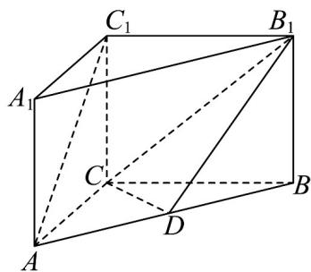

<!-- question-source:start -->
16. (15 分) 在三棱柱 $ABC - A_{1}B_{1}C_{1}$ 中， $AA_{1} \perp$ 平面 $ABC$ ， $AB = 5$ ， $AC = 3$ ， $BC = 4$ ， $D$ 是线段 $AB$ 上的一

个动点.

(1)若 $CD \perp AB$ ，求证：平面 $ABB_{1}A_{1} \perp$ 平面 $CDB_{1}$ ；

(2) 若 $A_{1}A = 3$ 且 $D$ 是线段 $AB$ 的中点，求直线 $CB_{1}$ 与平面 $ABB_{1}A_{1}$ 所成角的正弦值.
<!-- question-source:end -->

![[高中/课堂同步/题库/人教A版高中数学同步讲义(2026)/02_必修第二册/第八章 立体几何初步/单元测试/第八章_立体几何初步_高效培优单元自测_提升卷_/三_填空题_sec_04/questions/answers/Q00065307A1.md]]
