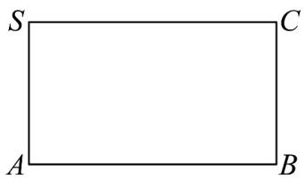
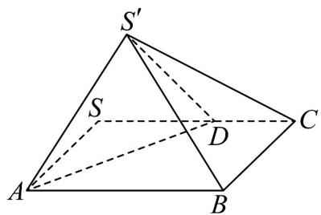

<!-- question-source:start -->
18. (17 分) 如图，在长方形 $SABC$ 中， $AB = 2\sqrt{3}$ ， $BC = 2$ ，设 $SD = x$ ， $(2 < x < 2\sqrt{3})$ ，将 $SAD$ 沿 $AD$

折起至 $\triangle S'AD$ ，使平面 $S'AB \perp$ 平面 $ABC$

(i)

(ii)

(1)证明： $BC\perp$ 平面 $S^{\prime}AB$ ；

(2)若二面角 $S^{\prime} - AD - B$ 的平面角的余弦值为 $\frac{4}{9}$ ，求 $SD$ 的长.
<!-- question-source:end -->

![[高中/课堂同步/题库/人教A版高中数学同步讲义(2026)/02_必修第二册/第八章 立体几何初步/单元测试/第八章_立体几何初步_高效培优单元自测_提升卷_/三_填空题_sec_04/questions/answers/Q00065309A1.md]]
