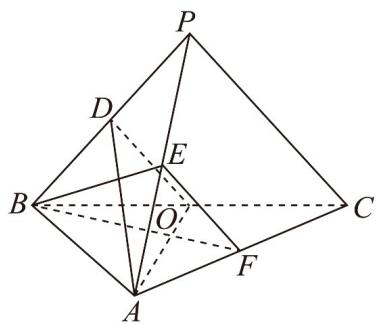

<!-- question-source:start -->
19.（17分）如图，在三棱锥 $P - ABC$ 中， $AB \perp BC$ ， $AB = 2$ ， $BC = 2\sqrt{2}$ ， $PB = PC = \sqrt{6}$ ， $BP$ ， $AP$

$BC$ 的中点分别为 $D$ ， $E$ ， $O$ ， $AD = \sqrt{5} DO$ ，点 $F$ 在 $AC$ 上， $BF\perp AO$

(1)证明： $EF \parallel$ 平面 ADO；

(2)证明：平面 $ADO \perp$ 平面 BEF；

(3)求二面角 $D - AO - C$ 的大小.
<!-- question-source:end -->

![[高中/课堂同步/题库/人教A版高中数学同步讲义(2026)/02_必修第二册/第八章 立体几何初步/单元测试/第八章_立体几何初步_高效培优单元自测_提升卷_/三_填空题_sec_04/questions/answers/Q00065310A1.md]]
