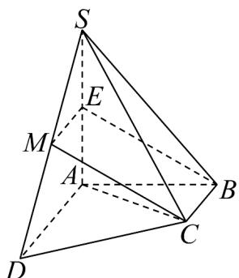

> [!faq]- 《第八章_立体几何初步_高效培优单元自测_提升卷_》官方解析
>
> > [!success]- **【答案】** $^{(1)}$ 证明见详解 $^{(2)}$ 证明见详解
>
> > [!note]- **【分析】**
> > （1）取 $SA$ 中点 $E$ ，连接 $EM,EB$ ，证明四边形 $BCME$ 是平行四边形即可证明结论；
> >
> > (2) 证明 $AC \perp CD$ ， $SA \perp CD$ 即可证明结论；
>
> > [!note]- **【解析】**
> > （1）取 $SA$ 中点 $E$ ，连接 $EM, EB$
> >
> > ∵ M 为 SD 的中点，∴ ME // AD, ME = $\frac{1}{2}$ AD，
> >
> > $\because AD / / BC, AD = 2, BC = 1 \therefore ME / / BC, ME = BC$
> >
> > ∴ $BCME$ 是平行四边形，即 $CM \parallel BE$ ，
> >
> > $\because CM\notin_{\text{平面}}SAB, BE\subset_{\text{平面}}SAB$
> >
> > ∴MC SAB
> > ∥平面
> >
> > 
> >
> > (2) $\because SA \perp$ 平面 $ABCD$ , $CD \subset$ 平面 $ABCD$ , $\therefore SA \perp CD$
> >
> > ∵ $AB \perp AD, AD // BC, AB = BC = 1, AD = 2$ ，则 $BC \perp AB$
> >
> > $\therefore AC = \sqrt{2}, CD = \sqrt{(2 - 1)^2 + 1^2} = \sqrt{2}$
> >
> > $\therefore AC^{2} + CD^{2} = AD^{2}$ ，即 $AC\perp CD$
> >
> > 又 $AC \cap AS = A, AC \subset$ 平面 $SAC$ ， $AS \subset$ 平面 $SAC$
> >
> > $\therefore CD \perp_{平面} SAC.$
