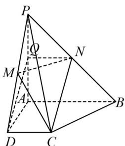

> [!faq]- 《第八章_立体几何初步_高效培优单元自测_提升卷_》官方解析
>
> > [!success]- **【答案】** (1)证明见解析(2) $\frac{\sqrt{2}}{2}$
>
> > [!note]- **【分析】**
> > （1）取 $PA$ 中点 $Q$ ，证明四边形 $DCNQ$ 为平行四边形，得到 $DQ \parallel AC$ ，根据线面平行的判定定
> >
> > 理即可证出线面平行·
> >
> > (2) 根据二面角的定义找出二面角对应的平面角，在直角三角形中利用三角函数求解即可·
>
> > [!note]- **【解析】**
> > （1）证明：取 $PA$ 中点 $Q$ ，连接 $NQ$ ， $DQ$
> >
> > 
> >
> > ∵N为PB的中点，
> >
> > $\therefore Q N \parallel A B$ ，且 $Q N = \frac{1}{2} A B = 1$
> >
> > 又 $DC \parallel AB$ ， $DC = 1$
> >
> > ∴QN ∥ DC，且QN = DC
> >
> > ∴四边形 DCNQ 为平行四边形，
> >
> > $\therefore DQ \parallel NC$
> >
> > 又 $NC \notin$ 平面 PAD， $DQ \subset$ 平面 PAD，
> >
> > ∴直线 NC ∥ 平面 PAD·
> >
> > (2)∵PA⊥平面ABCD，AD,DC⊂平面ABCD，
> >
> > $\therefore PA \perp DC, PA \perp AD$
> >
> > $$
> > \because \angle C D A = 9 0 ^ {0}, \therefore A D \perp C D,
> > $$
> >
> > 又 $PA \cap AD = A$ ， $PA, AD \subset$ 平面 PAD，
> >
> > $\therefore DC \perp$ 平面 PAD ，
> >
> > ∵PD⊂平面PAD，
> >
> > $\therefore DC \perp PD$
> >
> > ∴∠PDA 即为平面 PDC 与底面 ABCD 所成的锐二面角的平面角，
> >
> > 在 Rt△PAD 中，AD = AP = 2，则 $PD = \sqrt{AD^{2} + AP^{2}} = \sqrt{2^{2} + 2^{2}} = 2\sqrt{2}$ ，
> >
> > 则 $\cos \angle PDA = \frac{AD}{PD} = \frac{\sqrt{2}}{2}$
> >
> > 故平面 $PDC$ 与底面 $ABCD$ 所成的锐二面角的余弦值 $\frac{\sqrt{2}}{2}$
