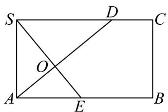
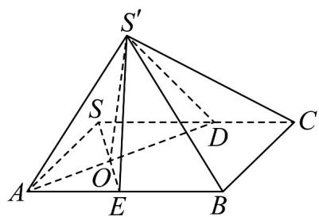

> [!faq]- 《第八章_立体几何初步_高效培优单元自测_提升卷_》官方解析
>
> > [!success]- **【答案】** $^{(1)}$ 证明见解析 (2)3
>
> > [!note]- **【分析】**
> > （1）应用面面垂直性质定理结合 $BC \perp AB$ ，即可得出线面垂直；
> >
> > (2) 应用二面角定义得出二面角 $S' - AD - B$ 的平面角为 $\angle S'OE$ ，再应用边长计算求值
>
> > [!note]- **【解析】**
> > （1）因为四边形 SABC 为长方形，所以 $BC \perp AB$ ，
> >
> > 又平面 $S^{\prime}AB \perp$ 平面 $ABC$ ，平面 $S^{\prime}AB \cap$ 平面 $ABC = AB$ ， $BC \subset$ 平面 $ABC$ ，
> >
> > 所以 $BC \perp$ 平面 $S'AB$ ；
> >
> > (2) 如图所示，在 (ii) 图中过点 S 作 $SO \perp AD$ ，垂足为 O，
> >
> > 
> > (i)
> >
> > 
> > (ii)
> >
> > 延长SO交AB于点E，连接 $S^{\prime}O$ ， $S^{\prime}E$ 。
> >
> > 由翻折知 $S'O \perp AD$ ，
> >
> > 所以二面角 $S' - AD - B$ 的平面角为 $\angle S'OE$
> >
> > 在（ii）图中设 $SD = x$ ，因为 $\mathrm{Rt}\triangle SAE$ 中， $\frac{SA^2}{AE^2} = \frac{SO\times SE}{OE\times SE} = \frac{SO}{OE}$
> >
> > 又因为 $\triangle SOD, \triangle OAE$ 相似，所以 $\frac{SD}{AE} = \frac{x}{AE}$ ，所以 $\frac{SA^2}{AE^2} = \frac{x}{AE}$
> >
> > 可得 $AE=\frac{4}{x}$ ， $SO=\frac{2x}{\sqrt{x^{2}+4}}$ ， $OE=\frac{8}{x\sqrt{x^{2}+4}}$ ，
> >
> > 又 $S^{\prime}O\perp AD,OE\perp AD,OE\cap S^{\prime}O = O,OE,S^{\prime}O\subset$ 平面 $S^{\prime}OE$ ，所以 $AD\perp$ 平面 $S^{\prime}OE$ ， $S^{\prime}E\subset$ 平面 $S^{\prime}OE$
> >
> > 所以 $S^{\prime}E \perp AD$ ，又因为 $BC \perp$ 平面 $S^{\prime}AB$ ， $S^{\prime}E \subset$ 平面 $S^{\prime}AB$ ，所以 $S^{\prime}E \perp BC$ ，
> >
> > BC, AD $\quad$ 是相交直线， $BC, AD \subset ABC$ ，平面
> >
> > 所以 $S^{\prime}E \perp$ 平面 ABC， $OE \subset$ 平面 ABC，所以 $S^{\prime}E \perp OE$ ，
> >
> > 因为 $\cos\angle S^{\prime}OE=\frac{4}{9}$ ，所以 $\frac{OE}{SO}=\frac{OE}{S^{\prime}O}=\frac{4}{9}$ ，
> >
> > 所以 $\frac{\frac{8}{x\sqrt{x^{2}+4}}}{\frac{2x}{\sqrt{x^{2}+4}}}=\frac{4}{x^{2}}=\frac{4}{9}$ ，解得 SD=x=3
