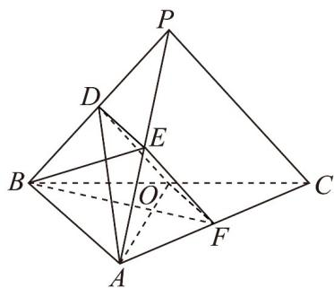
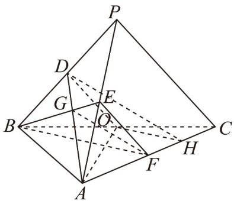

> [!faq]- 《第八章_立体几何初步_高效培优单元自测_提升卷_》官方解析
>
> > [!success]- **【答案】** (1)证明见解析 (2)证明见解析 (3) $135^{\circ}$
>
> > [!note]- **【分析】**
> > （1）连接 $DE$ ， $OF$ ，设 $AF = tAC$ ，根据 $BF \perp AO$ ，可得 $F$ 为 $AC$ 的中点，继而可证 $EF // OD$
> >
> > 再利用线面平行的判定推理作答；
> >
> > $^{(2)}$ 由 $^{(1)}$ 的信息，结合勾股定理的逆定理及线面垂直、面面垂直的判定推理作答；
> >
> > (3) 由 (2) 的信息作出并证明二面角的平面角，再结合三角形重心及余弦定理求解作答.
>
> > [!note]- **【解析】**
> > （1）证明：连接 DE，OF，
> >
> > 
> >
> > 设 $\overline{AF}=t\overline{AC}$ ，则 $\overline{BF}=(1-t)\overline{BA}+t\overline{BC}$ ， $\overline{AO}=-\overline{BA}+\frac{1}{2}\overline{BC}$ ，因为 $BF\perp AO$ ，
> >
> > $BF \cdot AO = \left[ (1 - t)BA + tBC \right] \cdot \left( -BA + \frac{1}{2} BC \right) = 4(t - 1) + 4t = 0$ 故
> >
> > 解得 $t=\frac{1}{2}$ ，即 F 为 AC 的中点。
> >
> > 因为 $BP$ ， $AP$ ， $BC$ ， $AC$ 的中点分别为 $D$ ， $E$ ， $O$ ， $F$
> >
> > 所以 $EF // PC$ ， $OD // PC$ ，则 $EF // OD$ ， $OD \subset$ 平面 $ADO$ ， $EF \notin$ 平面 $ADO$
> >
> > ∴ EF // 平面 ADO
> >
> > (2) 由 (1) 知 $AO = \sqrt{6}$ , $DO = \frac{\sqrt{6}}{2}$ , 得 $AD = \sqrt{5} DO = \frac{\sqrt{30}}{2}$
> >
> > 故 $OD^2 + AO^2 = AD^2 = \frac{15}{2}$ ，故 $OD \perp AO$ ，所以 $EF \perp AO$ ，
> >
> > 又 $BF \perp AO$ ， $BF \cap EF = F$
> >
> > $EF, BF \subset \text{平面} BEF$ ，所以 $AO \perp$ 平面 BEF ，又 $AO \subset \text{平面} ADO$
> >
> > 所以平面 $ADO \perp$ 平面 BEF；
> >
> > (3) 过点 O 作 $OH \parallel BF$ 交 AC 于点 H， $HO \perp AO$ ，且 $FH = \frac{1}{3} AH$
> >
> > 故 $\angle DOH$ 为二面角 $D - AO - C$ 的平面角.
> >
> > 
> >
> > 设 $AD \cap BE = G$ ， $G$ 为三角形 $PAB$ 的重心，所以 $DH = \frac{3}{2} GF$
> >
> > $\cos \angle ABD = \frac{4 + \frac{3}{2} - \frac{15}{2}}{2 \times 2 \times \frac{\sqrt{6}}{2}} = \frac{4 + 6 - PA^2}{2 \times 2 \times \sqrt{6}}$ 得 $PA = \sqrt{14}$ ，同理可得 $BE = \frac{\sqrt{6}}{2}$
> >
> > $\therefore BE^{2} + EF^{2} = BF^{2} = 3$ ，故 $BE\perp EF$ ，可得 $GF = \frac{\sqrt{15}}{3}$
> >
> > $\therefore DH = \frac{\sqrt{15}}{2}, OH = \frac{\sqrt{3}}{2}, DO = \frac{\sqrt{6}}{2}$
> >
> > 由余弦定理得 $\cos\angle DOH=-\frac{\sqrt{2}}{2}$
> >
> > ∴ 二面角 $D-AO-C$ 的大小为 $135^{\circ}$
