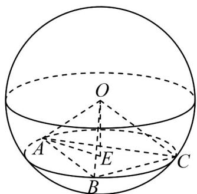
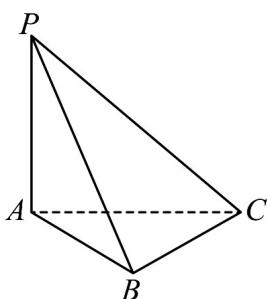

> [!faq]- 《第八章 立体几何初步（高效培优单元自测·强化卷）》官方解析
>
> > [!success]- **【答案】** C
>
> > [!note]- **【分析】**
> > 利用正四面体结构性质、体积公式和球体的体积公式计算即可·
>
> > [!note]- **【解析】**
> > 设球的半径为 $R$ ，则 $V_{2} = \frac{4}{3}\pi R^{3}$
> >
> > 因为 O-ABC 为正四面体，
> >
> > 所以可得 $OA = OB = OC = AB = BC = AC = R$
> >
> > 则底面正三角形 $ABC$ 的高为 $\frac{\sqrt{3}}{2} R$ ，面积为 $S = \frac{\sqrt{3}}{4} R^2$ ，过 $O$ 点作底面的垂线段，垂足为 $E$ ，
> >
> > 则由正四面体的结构性质可知 $E$ 为 $\triangle ABC$ 的中心，也是 $\triangle ABC$ 的重心，连接 $AE$ .
> >
> > 
> >
> > 则 $AE = \frac{2}{3} \times \frac{\sqrt{3}}{2} R = \frac{\sqrt{3}}{3} R$ ， $OA = R$ ，在直角三角形OEA中，
> >
> > 正四面体的高为 $h = \sqrt{OA^2 - AE^2} = \sqrt{R^2 - \frac{1}{3} R^2} = \frac{\sqrt{6}}{3} R$
> >
> > 则 $V_{1} = \frac{1}{3} Sh = \frac{\sqrt{2}}{12} R^{3}$ ，所以 $\frac{V_1}{V_2} = \frac{\frac{\sqrt{2}}{12} R^3}{\frac{4}{3}\pi R^3} = \frac{\sqrt{2}}{16\pi}$
> >
> > 故选：C
> >
> > 8．《九章算术》中，将四个面都为直角三角形的三棱锥称为鳖臑·若三棱锥 P-ABC 为鳖臑，PA⊥平面 ABC，PA=2， $\angle PBC=\frac{\pi}{2}$ ，且三棱锥 P-ABC 的外接球的表面积为 $20\pi$ ，则三棱锥 P-ABC 的体积的最大值为（）
> >
> > 【答案】
> >
> > A. $\sqrt{3}$ B. 2
> >
> > C. $\frac{4}{3}$ D. $\frac{8}{3}$
> >
> > 【答案】D
> >
> > 【分析】确定 $PC$ 的中点 $O$ 是鳖臑外接球的球心，结合外接球表面积得外接球半径 $R = \sqrt{5}$ ，进而求得 $AC$ ，再证明 $BC \perp AB$ ，进而结合勾股定理及基本不等式求得 $\left|AB\right| \cdot \left|BC\right| \leq 8$ ，再根据棱锥的体积公式即可求解。
> >
> > 【详解】在鳖臑 $P - ABC$ 中，四个面都为直角三角形，可知 $PC$ 的中点 $O$ 到四个顶点的距离都相等，
> >
> > 所以点 $O$ 是鳖臑外接球的球心，三棱锥 $P - ABC$ 的外接球的表面积为 $20\pi$ ，
> >
> > 则外接球半径 $R = \sqrt{5}$ ，所以 $PC = 2\sqrt{5}$ ，又 $PA = 2$ ，所以 $AC = 4$ ，
> >
> > 而 $\angle PBC = \frac{\pi}{2}$ ，则 $PB \perp BC$ ，
> >
> > 因为 $PA \perp$ 平面 $ABC$ ， $BC \subset$ 平面 $ABC$ ，所以 $PA \perp BC$ ，
> >
> > 又 $PA \cap PB = P, PA, PB \subset$ 平面 PAB ，所以 $BC \perp$ 平面 PAB ，
> >
> > 因为 $AB \subset$ 平面 $PAB$ ，所以 $BC \perp AB$
> >
> > 所以 $\left|AC\right|^{2}=16=\left|AB\right|^{2}+\left|BC\right|^{2}\quad2\left|AB\right|\cdot\left|BC\right|$
> >
> > 即 $\left|AB\right|\cdot\left|BC\right|\leq8$ ，当且仅当 $\left|AB\right|=\left|BC\right|=2\sqrt{2}$ 时取等号，
> >
> > 所以三棱锥 P-ABC 的体积为 $\frac{1}{3}\times\frac{1}{2}|AB|\times|BC|\times|PA|\leq\frac{1}{3}\times\frac{1}{2}\times8\times2=\frac{8}{3}$
> >
> > 则三棱锥 P-ABC 的体积的最大值为 $\frac{8}{3}$ .
> >
> > 故选：D
> >
> > 
> >
> > 二、选择题：本题共3小题，每小题6分，共18分．在每小题给出的选项中，有多项符合题目要求．全部选对的得6分，部分选对的得部分分，有选错的得0分.
