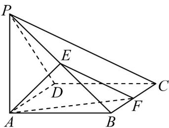

<!-- question-source:start -->
15．（13分）如图，在四棱锥 $P - ABCD$ 中，底面 $ABCD$ 是边长为2的正方形， $PA \perp$ 底面 $ABCD, PA = 2, E$

为线段 $PB$ 的中点， $BF = tBC(0 < t < 1)$ .

(1)证明：无论 $t$ 取何值，均有平面 $AEF \perp$ 平面 $PBC$ ；

(2)若平面 AEF 与平面 PAB 夹角的余弦值为 $\overline{3}$ ，求 t 的值·
<!-- question-source:end -->

![[高中/课堂同步/题库/人教A版高中数学同步讲义(2026)/02_必修第二册/第八章 立体几何初步/第八章 立体几何初步（高效培优单元自测·强化卷）/三_填空题/questions/answers/Q00069905A1.md]]
